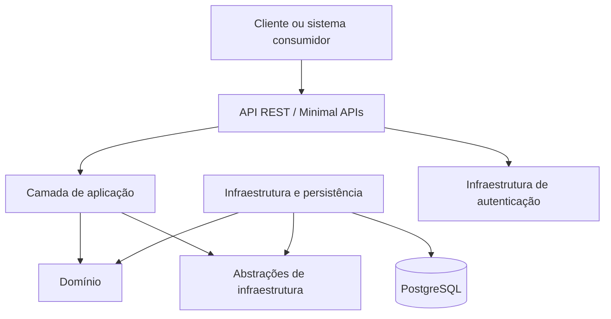

# Tech Challenge - Sistema de Gestão para Oficina Mecânica - Fase 2

Projeto desenvolvido para a **Pós-Tech da FIAP**. A Fase 2 evolui o mesmo repositório iniciado na Fase 1, com foco em qualidade, resiliência, escalabilidade, infraestrutura como código e automação de entrega.

O sistema centraliza clientes, veículos, Ordens de Serviço, orçamentos, serviços, produtos e estoque. A evolução desta fase deve completar as APIs operacionais, consolidar a arquitetura em camadas, executar em Kubernetes, provisionar cluster/banco com Terraform e automatizar build, testes, imagem e deploy.

> **Status auditado em 25/08/2026 (`3a41407`):** o build compila com 10 avisos, mas 8 de 102 testes unitários e todos os 20 testes de integração falham após a refatoração de Estoque/Categorias. Os manifestos K8s são parciais, Terraform não existe e não há pipeline completa de deploy. Consulte o [checklist de entregáveis](docs/fase-2-entregaveis.md) antes de considerar qualquer item pronto para entrega.

## Sumário

- [Contexto do desafio](#contexto-do-desafio)
- [Objetivos](#objetivos)
- [Entregáveis da Fase 2](#entregáveis-da-fase-2)
- [Escopo funcional](#escopo-funcional)
- [Fluxo principal da Ordem de Serviço](#fluxo-principal-da-ordem-de-serviço)
- [Domain-Driven Design](#domain-driven-design)
- [Arquitetura](#arquitetura)
- [Tecnologias](#tecnologias)
- [Estrutura do repositório](#estrutura-do-repositório)
- [Estado atual da implementação](#estado-atual-da-implementação)
- [Endpoints](#endpoints)
- [Como executar localmente](#como-executar-localmente)
- [Execução com Docker](#execução-com-docker)
- [Kubernetes](#kubernetes)
- [Terraform](#terraform)
- [CI/CD](#cicd)
- [Banco de dados](#banco-de-dados)
- [Testes](#testes)
- [Segurança](#segurança)
- [Documentação](#documentação)
- [Roadmap](#roadmap)
- [Equipe](#equipe)

## Contexto do desafio

A oficina mecânica utilizada como cenário do projeto realiza seus processos de atendimento, diagnóstico, execução e entrega por meio de anotações manuais e planilhas.

Essa operação descentralizada pode causar:

- erros na priorização dos atendimentos;
- falhas no controle de peças e insumos;
- dificuldade para acompanhar o estado dos serviços;
- perda do histórico de clientes e veículos;
- ineficiência na geração e aprovação de orçamentos;
- dificuldade para medir o tempo de execução dos serviços.

Como solução, o projeto propõe um **Sistema Integrado de Atendimento e Execução de Serviços**, oferecendo uma API para a operação da oficina e para o acompanhamento das Ordens de Serviço pelos clientes.

## Objetivos

Na Fase 1, o objetivo foi desenvolver o MVP do back-end da oficina em um monólito organizado em camadas e orientado por Domain-Driven Design. Na Fase 2, o objetivo é evoluir essa base para suportar crescimento com código sustentável, infraestrutura escalável e deploy automatizado.

O sistema deverá:

- centralizar os dados de clientes, veículos, funcionários, serviços e produtos;
- controlar todo o ciclo de vida de uma Ordem de Serviço;
- permitir a elaboração e aprovação de orçamentos;
- controlar a disponibilidade e o consumo de peças;
- manter o histórico do atendimento;
- disponibilizar o andamento da OS por API;
- oferecer documentação interativa com Swagger;
- permitir execução local e conteinerizada;
- aplicar validações, autenticação e testes automatizados nos fluxos críticos.
- refatorar segundo Clean Code e Clean Architecture/Arquitetura Hexagonal;
- priorizar a fila operacional de OS e integrar decisões externas de orçamento;
- notificar mudanças de estado por ferramenta externa;
- executar a aplicação em Kubernetes com configuração, segredos e HPA;
- provisionar cluster e banco com Terraform;
- automatizar build, testes, imagem e deploy por CI/CD.

## Entregáveis da Fase 2

O estado completo dos requisitos oficiais está no [Checklist de Entregáveis](docs/fase-2-entregaveis.md). Os principais itens ainda bloqueantes são: correção da persistência e das rotas de Estoque, recuperação dos testes, APIs completas da Fase 2, ConfigMap/Secret/HPA, Terraform, pipeline de deploy, link público das APIs, vídeo e PDF final do portal.

## Escopo funcional

### Clientes

- identificação por documento único (`tipoDocumento` + `documento`), com suporte a CPF, CNPJ ou RG;
- cadastro, consulta, atualização e exclusão;
- armazenamento de dados pessoais e endereço;
- consulta do histórico de Ordens de Serviço.

### Veículos

- cadastro de placa, marca, modelo e ano;
- associação do veículo ao cliente responsável;
- validação de placa e identificação de cadastros existentes;
- manutenção do histórico de atendimentos.

### Serviços

- cadastro dos serviços oferecidos pela oficina;
- definição do valor de cada serviço;
- inclusão de serviços no diagnóstico e no orçamento.

### Peças e insumos

- cadastro de produtos utilizados pela oficina;
- controle de preço e quantidade disponível;
- verificação de estoque antes do envio do orçamento;
- baixa de estoque durante a execução.

### Ordens de Serviço

- criação da OS a partir do cliente e do veículo;
- registro do problema relatado e das observações;
- atribuição da OS a um mecânico;
- registro do diagnóstico;
- inclusão de serviços, peças e insumos;
- cálculo do orçamento;
- envio para aprovação do cliente;
- acompanhamento das mudanças de estado;
- conclusão técnica, pagamento e entrega do veículo.

### Gestão administrativa

- CRUD dos principais cadastros;
- listagem e detalhamento das Ordens de Serviço;
- visualização das OS disponíveis para a oficina;
- acompanhamento do tempo médio de execução;
- controle do encerramento administrativo.

## Fluxo principal da Ordem de Serviço

O fluxo de negócio levantado durante o Event Storming é:

```text
Cliente e veículo identificados
  ↓
Recebida
  ↓
Em diagnóstico
  ↓
Orçamento calculado
  ↓
Aguardando aprovação
  ↓
Em execução
  ↓
Finalizada
  ↓
Entregue
```

Além do fluxo principal, o domínio considera cenários alternativos como:

- falta de produtos no estoque;
- aprovação parcial do orçamento;
- reprovação ou negociação de valores;
- identificação de serviços adicionais;
- compra externa de materiais;
- retorno da OS para retrabalho.

## Domain-Driven Design

O projeto utiliza DDD para representar o negócio da oficina a partir de sua linguagem e de suas regras.

### Linguagem ubíqua

| Termo | Significado |
| --- | --- |
| Cliente | Pessoa responsável pelo veículo e pela aprovação do orçamento |
| Veículo | Automóvel associado ao cliente e à Ordem de Serviço |
| Ordem de Serviço | Registro central do atendimento realizado pela oficina |
| Diagnóstico | Análise que identifica serviços e produtos necessários |
| Orçamento | Composição dos serviços, produtos, quantidades e valores |
| Serviço | Atividade técnica realizada pela oficina |
| Produto | Peça ou insumo utilizado na execução |
| Mecânico | Funcionário responsável pelo diagnóstico e pela execução |
| Administrador | Funcionário responsável pela gestão e pelo encerramento da OS |

### Agregado principal

A `OrdemServico` é o principal candidato a raiz de agregado. Ela coordena:

- cliente e veículo atendidos;
- funcionário responsável;
- descrição do problema;
- serviços e produtos;
- datas de criação, atualização e finalização;
- estado atual da execução;
- regras de transição entre os estados.

### Contextos identificados

- **Atendimento:** identificação do cliente, cadastro do veículo e abertura da OS.
- **Oficina:** atribuição do mecânico, diagnóstico e execução.
- **Orçamento:** cálculo, apresentação e aprovação dos itens.
- **Inventário:** disponibilidade, reserva e baixa de produtos.
- **Pagamento:** confirmação do valor final e geração do recibo.
- **Notificações:** comunicação com cliente, mecânico e administrador.

A documentação detalhada está disponível em:

- [Documentação DDD](docs/ddd.md)
- [Event Storming](docs/event-storming.md)
- [Requisitos funcionais](docs/requisitos.md)

## Arquitetura

O MVP foi estruturado como um **monólito em camadas**.



### Responsabilidades das camadas

| Camada | Responsabilidade |
| --- | --- |
| `TechChallenge.Api` | Endpoints REST, contratos HTTP, Swagger e middleware |
| `TechChallenge.Application` | Casos de uso, comandos e coordenação dos fluxos |
| `TechChallenge.Application.Abstractions` | Contratos da camada de aplicação, incluindo contratos dos repositórios |
| `TechChallenge.Domain` | Entidades, enums e regras centrais do negócio |
| `TechChallenge.Infrastructure.Auth` | JWT, hash de senha, refresh tokens, usuário atual e políticas de autorização |
| `TechChallenge.Infrastructure.Database` | Entity Framework Core, contexto, configurações, migrations e repositórios |
| `TechChallenge.Infrastructure.IoC` | Registro de dependências e composição da infraestrutura |
| `TechChallenge.Tests` | Testes unitários |
| `TechChallenge.IntegrationTests` | Testes de integração |

A arquitetura-alvo da Fase 2, incluindo componentes, infraestrutura provisionada e fluxo de deploy, está em [Arquitetura Proposta - Fase 2](docs/arquitetura-fase-2.md).

## Tecnologias

- **C#**
- **.NET 10**
- **ASP.NET Core Minimal APIs**
- **Entity Framework Core 10**
- **PostgreSQL**
- **JWT Bearer Authentication**
- **FluentValidation**
- **Swagger / OpenAPI**
- **xUnit**
- **Coverlet**
- **Qodana / SonarQube**
- **Docker**
- **Docker Compose**
- **GitHub Actions**

## Estrutura do repositório

```text
.
├── .github/
│   └── workflows/                     # Automações do GitHub Actions
├── docker-compose/                    # Orquestração dos containers
├── k8s/                               # Manifests parciais e overlays Kustomize
├── infra/                             # Pendente: Terraform para cluster e banco
├── docs/
│   ├── assets/                        # Diagramas e imagens
│   ├── arquitetura-fase-2.md           # Aplicação, infraestrutura e deploy propostos
│   ├── auditoria-estoque.md            # Auditoria técnica de Estoque e entidades
│   ├── ddd.md                         # Documentação de DDD
│   ├── event-storming.md              # Documentação do Event Storming
│   ├── fase-2-entregaveis.md           # Checklist oficial da Fase 2
│   ├── relatorio-vulnerabilidades.md  # Resultado e execução do scan
│   ├── requisitos.md                  # Requisitos funcionais
│   └── testes.md                      # Estratégia e cobertura de testes
├── src/
│   ├── TechChallenge.Api/             # API REST e roteiros de demonstração
│   ├── TechChallenge.Application/     # Casos de uso
│   ├── TechChallenge.Application.Abstractions/ # Contratos da aplicação e repositórios
│   ├── TechChallenge.Domain/          # Entidades de domínio
│   ├── TechChallenge.Infrastructure.Auth/
│   ├── TechChallenge.Infrastructure.Database/
│   └── TechChallenge.Infrastructure.IoC/
├── tests/
│   ├── TechChallenge.Tests/
│   └── TechChallenge.IntegrationTests/
└── TechChallenge.slnx
```

## Estado atual da implementação

Esta seção diferencia os requisitos do produto do que já está efetivamente disponível no código.

| Funcionalidade | Estado auditado |
| --- | --- |
| Estrutura em projetos/camadas | Presente; Clean Architecture parcial |
| Entidades com acessores encapsulados | Refatoradas; invariantes e compatibilidade EF incompletas |
| EF Core/PostgreSQL | Existente; novo `Estoque` bloqueia a criação do modelo |
| Migrations | Existem para a Fase 1; faltam Estoque e Categorias |
| Cadastros, autenticação e fluxo principal da OS | Código presente, com regressões na suíte |
| Categorias de produto, serviço e veículo | Endpoints/casos de uso presentes; sem migration e sem testes específicos |
| Estoque separado de Produto | Parcial e bloqueado por rotas, mapping, migration e invariantes |
| Abertura completa da OS com itens | Parcial; serviços/produtos não entram no contrato de abertura |
| Consulta exclusiva de status | Bloqueada por rota GET duplicada |
| Decisão externa do orçamento | Não implementada |
| Priorização da listagem | Filtro existe, ordenação está invertida |
| Notificação externa de status | Não implementada; há somente logs internos |
| Docker Compose | Configuração validada |
| Kubernetes | Deployment/Service parciais; selector e overlay inválidos; sem ConfigMap, Secret e HPA |
| Terraform | Não implementado |
| CI/CD completo | Parcial; build e imagem separados, testes manuais, sem deploy |
| Testes | 94/102 unitários aprovados; 0/20 integrações aprovadas |
| Cobertura de 84,1% | Evidência histórica anterior à refatoração; precisa novo scan |

> A autorização possui política de fallback: por padrão, todo endpoint exige usuário autenticado. As exceções explícitas são login, refresh token, Swagger/OpenAPI e demais rotas marcadas com `AllowAnonymous`.

## Endpoints

Todos os endpoints utilizam o prefixo `/api/v1`.

Com a API em execução, a collection completa é exposta por:

- Swagger UI: `http://localhost:5020/swagger` no perfil local ou `http://localhost:8080/swagger` no Docker;
- OpenAPI JSON: `/openapi/v1.json`.

Ainda falta publicar uma URL estável ou versionar uma collection Postman para uso fora do ambiente local.

Erros são retornados no formato `ProblemDetails`, com `status`, `title`, `detail` e `traceId`. Falhas de validação utilizam `ValidationProblemDetails` e agrupam as mensagens por campo. Detalhes internos não são expostos em respostas de erro 500.

### Autenticação

| Método | Rota | Descrição | Acesso |
| --- | --- | --- | --- |
| `POST` | `/api/v1/auth/login` | Autentica usuário e retorna access token e refresh token | Anônimo |
| `POST` | `/api/v1/auth/refresh` | Renova access token usando refresh token | Anônimo |
| `GET` | `/api/v1/auth/me` | Retorna dados do usuário autenticado | Autenticado |
| `POST` | `/api/v1/auth/logout` | Revoga os refresh tokens ativos do usuário autenticado | Autenticado |
| `POST` | `/api/v1/auth/logout-all` | Revoga os refresh tokens ativos do usuário autenticado | Autenticado |
| `PATCH` | `/api/v1/auth/senha` | Troca a senha do usuário autenticado | Autenticado |
| `GET` | `/api/v1/auth/refresh-tokens` | Lista refresh tokens ativos do usuário autenticado | Autenticado |
| `DELETE` | `/api/v1/auth/refresh-tokens/{refreshTokenId}` | Revoga um refresh token específico | Autenticado |

### Clientes

| Método | Rota | Descrição | Acesso |
| --- | --- | --- | --- |
| `POST` | `/api/v1/clientes` | Cadastra um cliente | Administrador ou Vendedor |
| `GET` | `/api/v1/clientes` | Lista os clientes | Autenticado |
| `GET` | `/api/v1/clientes/{id}` | Consulta um cliente | Autenticado |
| `PUT` | `/api/v1/clientes/{id}` | Atualiza um cliente | Administrador ou Vendedor |
| `DELETE` | `/api/v1/clientes/{id}` | Exclui um cliente | Administrador ou Vendedor |

O cadastro de cliente recebe `tipoDocumento` (`Cpf`, `Cnpj` ou `Rg`) e `documento`. A API valida e normaliza o documento conforme o tipo informado, mantendo unicidade em uma única coluna.

### Veículos

| Método | Rota | Descrição | Acesso |
| --- | --- | --- | --- |
| `POST` | `/api/v1/veiculos` | Cadastra um veículo | Administrador ou Vendedor |
| `GET` | `/api/v1/veiculos` | Lista os veículos | Autenticado |
| `GET` | `/api/v1/veiculos/{id}` | Consulta um veículo | Autenticado |
| `PUT` | `/api/v1/veiculos/{id}` | Atualiza um veículo | Administrador ou Vendedor |
| `DELETE` | `/api/v1/veiculos/{id}` | Exclui um veículo | Administrador ou Vendedor |

### Funcionários

| Método | Rota | Descrição | Acesso |
| --- | --- | --- | --- |
| `POST` | `/api/v1/funcionarios` | Cadastra um funcionário | Administrador |
| `GET` | `/api/v1/funcionarios` | Lista os funcionários | Administrador |
| `GET` | `/api/v1/funcionarios/{id}` | Consulta um funcionário | Administrador |
| `PUT` | `/api/v1/funcionarios/{id}` | Atualiza um funcionário | Administrador |
| `DELETE` | `/api/v1/funcionarios/{id}` | Exclui um funcionário | Administrador |

### Serviços

| Método | Rota | Descrição | Acesso |
| --- | --- | --- | --- |
| `POST` | `/api/v1/servicos` | Cadastra um serviço | Administrador ou Vendedor |
| `GET` | `/api/v1/servicos` | Lista os serviços | Autenticado |
| `GET` | `/api/v1/servicos/{id}` | Consulta um serviço | Autenticado |
| `PUT` | `/api/v1/servicos/{id}` | Atualiza um serviço | Administrador ou Vendedor |
| `DELETE` | `/api/v1/servicos/{id}` | Exclui um serviço | Administrador ou Vendedor |

### Categorias

Há CRUDs em `/api/v1/categoriaproduto`, `/api/v1/categoriaservico` e `/api/v1/categoriaveiculo`. Eles foram adicionados na refatoração da Fase 2, mas ainda não possuem migration nem testes específicos e não devem ser considerados prontos para produção.

### Produtos e inventário

| Método | Rota | Descrição | Acesso |
| --- | --- | --- | --- |
| `POST` | `/api/v1/produtos` | Cadastra um produto | Administrador ou Vendedor |
| `GET` | `/api/v1/produtos` | Lista o inventário | Autenticado |
| `GET` | `/api/v1/produtos/{id}` | Consulta um produto | Autenticado |
| `PUT` | `/api/v1/produtos/{id}` | Atualiza um produto | Administrador ou Vendedor |
| `DELETE` | `/api/v1/produtos/{id}` | Exclui um produto | Administrador ou Vendedor |

Após a refatoração, `Produto` representa catálogo (descrição, valor e categoria), enquanto a quantidade pertence à entidade `Estoque`. O contrato atual de produto ainda não envia `IdCategoria` ao comando, portanto também precisa ser alinhado ao novo modelo.

### Estoque

| Método atual | Rota atual | Intenção | Situação auditada |
| --- | --- | --- | --- |
| `POST` | `/api/v1/estoque` | Adicionar quantidade | Bloqueado: o endpoint ignora a quantidade do request |
| `GET` | `/api/v1/estoque` | Listar saldos | Bloqueado pela materialização do EF Core |
| `DELETE` | `/api/v1/estoque/{produtoId}` | Consultar saldo | Verbo e binding incorretos; deveria ser consulta GET |
| `PUT` | `/api/v1/estoque` | Baixar quantidade | Busca identificador errado, permite saldo negativo e retorna status inadequado |

Não use essas rotas como contrato definitivo antes das correções descritas na [Auditoria do Estoque](docs/auditoria-estoque.md).

### Ordens de Serviço

| Método | Rota | Descrição | Acesso |
| --- | --- | --- | --- |
| `POST` | `/api/v1/ordens-servico` | Cria uma OS no estado `Recebida` | Administrador ou Vendedor |
| `GET` | `/api/v1/ordens-servico` | Lista as Ordens de Serviço | Administrador ou Vendedor |
| `GET` | `/api/v1/ordens-servico/{id}` | Consulta uma OS | Administrador, Mecânico ou Vendedor |
| `GET` | `/api/v1/ordens-servico/oficina` | Lista as OS destinadas à visualização da oficina | Administrador, Mecânico ou Vendedor |
| `GET` | `/api/v1/ordens-servico/acompanhamento/{codigo}` | Consulta pública de acompanhamento da OS por código | Anônimo |
| `GET` | `/api/v1/ordens-servico/tempo-medio-execucao` | Retorna a quantidade de OS finalizadas e o tempo médio de execução | Administrador ou Vendedor |
| `PATCH` | `/api/v1/ordens-servico/{id}/atribuir` | Atribui a OS e inicia o diagnóstico | Mecânico |
| `PATCH` | `/api/v1/ordens-servico/{id}/diagnostico` | Registra serviços e produtos do diagnóstico | Mecânico |
| `PATCH` | `/api/v1/ordens-servico/{id}/orcamento/enviar` | Calcula o orçamento e o envia para aprovação | Administrador, Mecânico ou Vendedor |
| `PATCH` | `/api/v1/ordens-servico/{id}/aprovar` | Aprova o orçamento e inicia a execução | Administrador ou Vendedor |
| `PATCH` | `/api/v1/ordens-servico/{id}/reprovar` | Reprova o orçamento | Administrador ou Vendedor |
| `PATCH` | `/api/v1/ordens-servico/{id}/retornar-para-diagnostico` | Retorna uma OS reprovada para diagnóstico | Administrador, Mecânico ou Vendedor |
| `PATCH` | `/api/v1/ordens-servico/{id}/finalizar` | Finaliza a execução | Mecânico |
| `PATCH` | `/api/v1/ordens-servico/{id}/entregar` | Registra a entrega do veículo | Administrador ou Vendedor |
| `PATCH` | `/api/v1/ordens-servico/{id}/cancelar` | Cancela uma OS não encerrada | Administrador |
| `DELETE` | `/api/v1/ordens-servico/{id}` | Exclui uma OS | Administrador |

O endpoint exclusivo de status ainda não está disponível de forma válida: foi mapeado com o mesmo método e rota da consulta completa, causando conflito `ASP0022`. A rota recomendada é `GET /api/v1/ordens-servico/{id}/status`.

### Usuários

| Método | Rota | Descrição | Acesso |
| --- | --- | --- | --- |
| `POST` | `/api/v1/usuarios` | Cria usuário | Administrador |
| `GET` | `/api/v1/usuarios` | Lista usuários | Administrador |
| `GET` | `/api/v1/usuarios/{id}` | Consulta usuário | Administrador |
| `PATCH` | `/api/v1/usuarios/{id}/tipo` | Altera perfil do usuário | Administrador |
| `PATCH` | `/api/v1/usuarios/{id}/vincular-funcionario` | Vincula usuário a funcionário | Administrador |
| `PATCH` | `/api/v1/usuarios/{id}/desvincular-funcionario` | Desvincula usuário de funcionário | Administrador |
| `PATCH` | `/api/v1/usuarios/{id}/ativar` | Ativa usuário | Administrador |
| `PATCH` | `/api/v1/usuarios/{id}/desativar` | Desativa usuário e revoga refresh tokens | Administrador |
| `PATCH` | `/api/v1/usuarios/{id}/resetar-senha` | Redefine senha de usuário | Administrador |

## Como executar localmente

### Pré-requisitos

- [.NET SDK 10](https://dotnet.microsoft.com/download/dotnet/10.0)
- Git
- Docker Desktop, caso utilize containers
- PostgreSQL local, ou Docker Compose para subir o banco

### 1. Clonar o repositório

```bash
git clone https://github.com/louistx/fiap-tech-challenge.git
cd fiap-tech-challenge
```

### 2. Restaurar as dependências da API

```bash
dotnet restore src/TechChallenge.Api/TechChallenge.Api.csproj
```

### 3. Configurar conexão, JWT e usuário inicial

Não mantenha usuário e senha reais no `appsettings.json`. Para desenvolvimento local, utilize User Secrets:

```bash
dotnet user-secrets set \
  "ConnectionStrings:DefaultConnection" \
  "Host=localhost;Port=5432;Database=TechChallenge;Username=postgres;Password=SUA_SENHA" \
  --project src/TechChallenge.Api/TechChallenge.Api.csproj

dotnet user-secrets set \
  "Jwt:SecretKey" \
  "troque-por-uma-chave-com-mais-de-32-caracteres" \
  --project src/TechChallenge.Api/TechChallenge.Api.csproj

dotnet user-secrets set \
  "Seed:AdminPassword" \
  "SenhaAdmin123" \
  --project src/TechChallenge.Api/TechChallenge.Api.csproj
```

Também é possível utilizar a variável de ambiente:

```bash
export ConnectionStrings__DefaultConnection="Host=localhost;Port=5432;Database=TechChallenge;Username=postgres;Password=SUA_SENHA"
export Jwt__SecretKey="troque-por-uma-chave-com-mais-de-32-caracteres"
export Seed__AdminPassword="SenhaAdmin123"
```

Se `Seed:AdminPassword` estiver configurado e a tabela de usuários estiver vazia, a aplicação cria o usuário inicial `admin`. As opções `Seed:FakeData` e `Seed:DemoData` habilitam, respectivamente, dados fictícios e o conjunto estável utilizado nos roteiros de demonstração. Em desenvolvimento, `appsettings.Development.json` já traz valores locais para bootstrap e demonstração.

### 4. Compilar a API

```bash
dotnet build src/TechChallenge.Api/TechChallenge.Api.csproj --no-restore
```

### 5. Executar a API

```bash
dotnet run --project src/TechChallenge.Api/TechChallenge.Api.csproj
```

Pelo perfil HTTP local, a aplicação utiliza:

```text
http://localhost:5020
```

### 6. Acessar a documentação da API

Com a aplicação em execução:

- Swagger UI: [http://localhost:5020/swagger](http://localhost:5020/swagger)
- OpenAPI JSON: [http://localhost:5020/openapi/v1.json](http://localhost:5020/openapi/v1.json)

### Validar a solução completa

Após restaurar todos os projetos, a solução completa pode ser validada com:

```bash
dotnet restore TechChallenge.slnx
dotnet build TechChallenge.slnx --no-restore
```

> A aplicação executa migrations automaticamente na inicialização, exceto no ambiente `Testing`.

## Execução com Docker

O repositório possui `Dockerfile` e Docker Compose com API e PostgreSQL:

A partir da raiz:

```bash
docker compose \
  -f docker-compose/docker-compose.yml \
  -f docker-compose/docker-compose.override.yml \
  up --build
```

A API é exposta em:

```text
http://localhost:8080
```

Para encerrar:

```bash
docker compose \
  -f docker-compose/docker-compose.yml \
  -f docker-compose/docker-compose.override.yml \
  down
```

O PostgreSQL fica exposto localmente em:

```text
localhost:5432
```

### Demonstração do fluxo da OS

Com a API disponível em `http://localhost:8080` e `Seed:DemoData` habilitado, execute em ordem os arquivos `.http` de `src/TechChallenge.Api/demo`. Eles demonstram autenticação, cadastros, ciclo completo da OS, falta de estoque, acompanhamento público e métricas.

As credenciais, IDs fixos e instruções estão em [Demo do fluxo completo da OS](src/TechChallenge.Api/demo/README.md).

### SonarQube local

Para subir o SonarQube local:

```bash
docker compose \
  -f docker-compose/docker-compose.yml \
  -f docker-compose/docker-compose.override.yml \
  up -d sonarqube
```

O SonarQube fica disponível em:

```text
http://localhost:9000
```

No primeiro acesso, use `admin`/`admin` e altere a senha. Para publicar uma análise local, o scanner não reutiliza a sessão do navegador; ele precisa de um token do próprio SonarQube local.

Crie o token em:

```text
My Account > Security > Generate Tokens
```

Depois execute a análise com cobertura a partir da raiz do repositório:

```bash
export SONAR_TOKEN="seu-token"

dotnet tool restore

dotnet tool run dotnet-sonarscanner -- begin \
  /k:"fiap-tech-challenge" \
  /d:sonar.host.url="http://localhost:9000" \
  /d:sonar.token="$SONAR_TOKEN" \
  /d:sonar.cs.opencover.reportsPaths=".sonar/coverage/**/coverage.opencover.xml" \
  /d:sonar.coverage.exclusions="**/Migrations/**,**/Program.cs,**/obj/**,**/Seeding/**,**/Context/ApplicationDbContextFactory.cs" \
  /d:sonar.cpd.exclusions="**/Migrations/**,tests/**/*.cs"

dotnet build TechChallenge.slnx --no-incremental

dotnet test tests/TechChallenge.Tests/TechChallenge.Tests.csproj \
  --no-build \
  /p:CollectCoverage=true \
  /p:CoverletOutputFormat=opencover \
  /p:CoverletOutput=../../.sonar/coverage/unit/

dotnet test tests/TechChallenge.IntegrationTests/TechChallenge.IntegrationTests.csproj \
  --no-build \
  /p:CollectCoverage=true \
  /p:CoverletOutputFormat=opencover \
  /p:CoverletOutput=../../.sonar/coverage/integration/

dotnet tool run dotnet-sonarscanner -- end \
  /d:sonar.token="$SONAR_TOKEN"
```

Após o processamento, acesse o relatório em:

```text
http://localhost:9000/dashboard?id=fiap-tech-challenge
```

Essa configuração usa o banco embutido do SonarQube e é indicada apenas para análise local. Em Linux, caso o container não inicie, ajuste `vm.max_map_count` conforme a recomendação exibida pelo próprio container.

## Kubernetes

O repositório já contém uma base Kustomize em `/k8s`, mas ela ainda não representa um deploy funcional. Nesta auditoria:

- `kubectl kustomize k8s/base` renderizou Deployment e Service;
- o selector do Service não corresponde aos labels dos pods;
- o overlay local falhou porque `namespace.yaml` não existe;
- não foram encontrados ConfigMap, Secret, HPA, banco, probes ou requests/limits.

Depois de corrigir esses itens, o fluxo esperado será:

```bash
kubectl apply -k k8s/overlays/docker-local
kubectl rollout status deployment/fiap-tech-challenge-api-local
kubectl get pods,service,hpa -n techchallenge
```

Os comandos são documentação do procedimento-alvo; os manifests atuais ainda não permitem executá-lo até o fim. Consulte [Arquitetura Proposta - Fase 2](docs/arquitetura-fase-2.md).

## Terraform

O diretório `/infra` e os scripts Terraform ainda não foram implementados. A Fase 2 exige provisionamento do cluster Kubernetes e do banco, além da descrição dos recursos e de como aplicar.

A estrutura, decisões pendentes e comandos futuros de `init`, `validate`, `plan` e `apply` estão documentados em [Arquitetura Proposta - Fase 2](docs/arquitetura-fase-2.md). Esses comandos só serão executáveis depois que provedor, módulos, ambientes, variáveis e backend de estado forem definidos.

## CI/CD

O estado atual é:

| Workflow | Gatilho | Cobertura |
| --- | --- | --- |
| `build.yml` | push em `main` e manual | restore e build |
| `unit-tests.yml` | manual | testes unitários |
| `integration-tests.yml` | manual | testes de integração |
| `docker-image.yml` | manual | build e push para GHCR |
| `discord-notifications.yml` | push/PR | notificação de eventos do repositório |

Ainda faltam gates automáticos de testes e jobs para Terraform, banco, aplicação dos manifests, rollout e smoke test. Além disso, a suíte atual está vermelha, portanto nenhum deploy deve ser promovido antes da recuperação dos testes.

## Banco de dados

O projeto utiliza **PostgreSQL** por meio do Entity Framework Core e provider Npgsql.

### Justificativa

O PostgreSQL foi escolhido porque:

- oferece transações e integridade referencial para os dados da OS;
- atende bem aos relacionamentos entre clientes, veículos, funcionários, serviços e produtos;
- permite migrations versionadas junto ao código;
- pode ser executado localmente ou em container.

O repositório já contém:

- `ApplicationDbContext`;
- mapeamentos das entidades;
- repositórios iniciais;
- migrations versionadas;
- factory para operações de design time.

Para trabalhar com migrations, instale a ferramenta do Entity Framework caso ela ainda não esteja disponível:

```bash
dotnet tool install --global dotnet-ef
```

Exemplo de atualização do banco:

```bash
dotnet ef database update \
  --project src/TechChallenge.Infrastructure.Database/TechChallenge.Infrastructure.Database.csproj \
  --startup-project src/TechChallenge.Api/TechChallenge.Api.csproj
```

## Testes

O projeto utiliza **xUnit** como framework para criação e execução dos testes automatizados em .NET.

Os testes estão organizados em dois projetos:

- `TechChallenge.Tests`: testes unitários das entidades, regras de domínio e serviços de aplicação;
- `TechChallenge.IntegrationTests`: testes de integração da API, banco de dados, repositórios e fluxos completos.

Entre os principais cenários cobertos ou em expansão estão:

- cadastro e validação de clientes, veículos, serviços, usuários e autenticação;
- criação e consulta de Ordens de Serviço;
- atribuição de uma OS a um mecânico;
- mudanças válidas e inválidas de estado da OS;
- registro do diagnóstico;
- cálculo e aprovação do orçamento;
- verificação e baixa de produtos no estoque;
- tratamento de erros e respostas HTTP da API.

Para executar todos os testes:

```bash
dotnet test TechChallenge.slnx
```

Para executar somente os testes unitários:

```bash
dotnet test tests/TechChallenge.Tests/TechChallenge.Tests.csproj
```

Para executar os testes de integração:

```bash
dotnet test tests/TechChallenge.IntegrationTests/TechChallenge.IntegrationTests.csproj
```

Para coletar cobertura:

```bash
dotnet test TechChallenge.slnx \
  --collect:"XPlat Code Coverage"
```

O **Coverlet** será utilizado em conjunto com o xUnit para medir a cobertura dos testes.

> **Situação auditada:** existem 102 testes unitários e 20 de integração. Em 25/08/2026, 94 unitários passaram, 8 falharam e todos os 20 testes de integração falharam. A cobertura de 84,1% pertence a uma execução anterior e precisa ser recalculada depois das correções.

## Segurança

O escopo de segurança implementado inclui:

- autenticação JWT Bearer;
- access token com claims `sub`, `role`, `name` e `funcionarioId`;
- refresh token opaco armazenado como hash SHA-256;
- rotação de refresh token;
- logout revogando refresh tokens ativos;
- listagem e revogação de refresh tokens ativos;
- hash de senha com PBKDF2;
- política de senha com mínimo de 8 caracteres, letra e número;
- autorização por perfil de usuário: `Administrador`, `Vendedor` e `Mecanico`;
- fallback policy exigindo autenticação por padrão;
- proteção dos segredos de conexão;
- tratamento padronizado de exceções;
- análise de vulnerabilidades das dependências e do código como etapa operacional.

Políticas disponíveis:

| Política | Perfis |
| --- | --- |
| `AdminOnly` | `Administrador` |
| `AdminOuVendedor` | `Administrador`, `Vendedor` |
| `Mecanico` | `Mecanico` |
| `MecanicoOuVendedor` | `Administrador`, `Mecanico`, `Vendedor` |

Para verificar dependências vulneráveis:

```bash
dotnet list TechChallenge.slnx package --vulnerable --include-transitive
```

Para auditar as imagens Docker, pode ser utilizada uma ferramenta como Trivy:

```bash
trivy image techchallengeapi
```

Os resultados obtidos, a evidência e as limitações estão registrados no [relatório de análise de vulnerabilidades](docs/relatorio-vulnerabilidades.md).

## Documentação

| Documento | Conteúdo |
| --- | --- |
| [Índice da documentação](docs/README.md) | Acesso central aos documentos |
| [Entregáveis da Fase 2](docs/fase-2-entregaveis.md) | Checklist oficial com evidências, lacunas e bloqueadores |
| [Arquitetura da Fase 2](docs/arquitetura-fase-2.md) | Componentes, infraestrutura-alvo, fluxo de deploy, Kubernetes e Terraform |
| [Auditoria do Estoque](docs/auditoria-estoque.md) | Endpoint, entidade, validações, acessores, persistência e testes |
| [Documento de entrega da Fase 2](docs/entrega-fase-2.md) | Fonte do PDF final, links e checklist de exportação |
| [Roteiro do vídeo da Fase 2](docs/roteiro-video-fase-2.md) | Sequência de demonstração para até 15 minutos |
| [DDD](docs/ddd.md) | Domínio, agregado, estados, comandos e relação com o código |
| [Event Storming](docs/event-storming.md) | Fluxos, eventos, políticas e pontos de decisão |
| [Requisitos funcionais](docs/requisitos.md) | Levantamento inicial dos requisitos |
| [Testes automatizados](docs/testes.md) | Estratégia, cenários cobertos, execução, cobertura e limitações |
| [Análise de vulnerabilidades](docs/relatorio-vulnerabilidades.md) | Resultado do SonarQube, evidência, interpretação e reprodução do scan |
| [Roteiro de demonstração](src/TechChallenge.Api/demo/README.md) | Fluxo completo da OS, estoque, acompanhamento e métricas por arquivos `.http` |
| [Quadro no Figma](https://www.figma.com/board/RDxPpsRgOD8J3wvPTh2659/Untitled?node-id=0-1&p=f) | Event Storming colaborativo |

## Roadmap

### Fase 2

- [ ] Concluir a refatoração de entidades e acessores; corrigir invariantes e materialização do EF Core (parcial).
- [ ] Corrigir e testar as rotas de Estoque e Categorias.
- [ ] Criar migration para Estoque/Categorias.
- [ ] Recuperar os 8 testes unitários e os 20 testes de integração falhos.
- [ ] Abrir OS com cliente, veículo, serviços e produtos no mesmo contrato.
- [ ] Criar rota exclusiva e não ambígua para consulta de status.
- [ ] Corrigir prioridade da listagem e o tratamento de estados alternativos.
- [ ] Implementar callback externo de aprovação/recusa e notificação externa de status.
- [ ] Revisar Dockerfile e validar build da imagem; Docker Compose está sintaticamente válido (parcial).
- [ ] Corrigir/completar K8s com selector, overlay, ConfigMap, Secret, HPA, banco, probes e recursos (parcial).
- [ ] Criar Terraform em `/infra` para cluster e banco.
- [ ] Integrar build, testes, imagem e deploy na pipeline.
- [ ] Publicar collection/Swagger estável, gravar vídeo e gerar PDF de entrega.

### Base da Fase 1

- [x] Estruturar a solução .NET.
- [x] Criar os projetos de domínio, aplicação, API e infraestrutura.
- [x] Modelar as entidades iniciais.
- [x] Configurar o Entity Framework Core e a migration inicial.
- [x] Integrar PostgreSQL via EF Core/Npgsql.
- [x] Criar e integrar endpoints principais aos casos de uso.
- [x] Implementar autenticação JWT.
- [x] Implementar refresh tokens e logout.
- [x] Implementar hash de senha e política mínima de senha.
- [x] Implementar RBAC por perfil de usuário.
- [x] Adicionar PostgreSQL ao Docker Compose.
- [x] Criar testes unitários e de integração iniciais.
- [x] Documentar DDD e Event Storming.
- [x] Refinar políticas de acesso por endpoint de OS, diferenciando vendedor, mecânico e administrador.
- [x] Completar os estados e as regras de transição do fluxo principal da OS.
- [x] Implementar cálculo, envio, aprovação e reprovação do orçamento.
- [x] Implementar retorno de orçamento reprovado para diagnóstico.
- [x] Implementar finalização técnica, entrega e cancelamento da OS.
- [ ] Implementar aprovação parcial e negociação.
- [ ] Implementar reserva efetiva de estoque.
- [x] Implementar validação e normalização de CPF, CNPJ e placa.
- [x] Implementar notificações internas simuladas via logger.
- [ ] Implementar pagamento e recibo.
- [x] Ampliar testes unitários e de integração dos fluxos críticos.
- [x] Atingir cobertura mínima de 80% nos fluxos críticos.
- [x] Executar e documentar a análise de vulnerabilidades.

## Equipe

| Participante | RM | GitHub |
| --- | --- | --- |
| Gabriel Teixeira | RM374752 | [@louistx](https://github.com/louistx) |
| Brunno de Oliveira | RM374818 | [@DevDoubleN](https://github.com/DevDoubleN) |
| Luís Henrique | RM374786 | [@Ace0777](https://github.com/Ace0777) |
| Caio Montilha | RM375494 | [@cmontilha](https://github.com/cmontilha) |
| Gustavo Keiji | RM374965 | [@GuKeiji](https://github.com/GuKeiji) |

## Repositório

[github.com/louistx/fiap-tech-challenge](https://github.com/louistx/fiap-tech-challenge)

---

Projeto acadêmico desenvolvido para o **Tech Challenge da Pós-Tech FIAP**.
