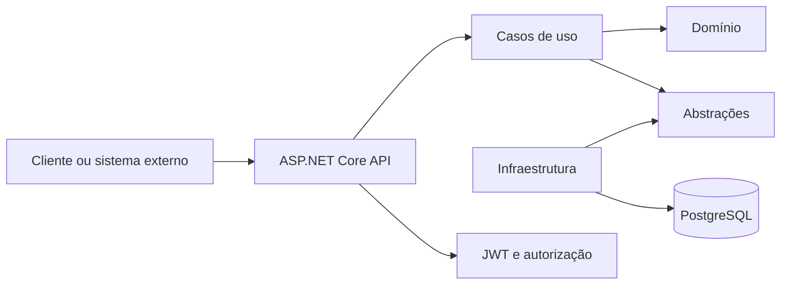

# Tech Challenge - Oficina Mecânica - Fase 2

API desenvolvida para a **Pós-Tech FIAP**, evoluindo o projeto da Fase 1. O sistema administra clientes, veículos, serviços, produtos, estoque e todo o ciclo de vida das Ordens de Serviço (OS).

A Fase 2 concentra-se em evolução da arquitetura, APIs operacionais, controle de estoque, testes automatizados, conteinerização, Kubernetes, Terraform e CI/CD.

> **Status verificado em 26/08/2026:** build sem avisos, 111 testes unitários e 26 testes de integração aprovados. O progresso detalhado está no [checklist de entregáveis](docs/fase-2-entregaveis.md).

## Entregáveis da Fase 2

| Área | Estado atual |
| --- | --- |
| Clean Code e arquitetura em camadas | Parcial |
| APIs obrigatórias da OS | Parcial |
| Estoque e categorias | Concluído |
| Docker e Docker Compose | Parcialmente validado |
| Kubernetes | Parcial |
| Terraform | Pendente |
| CI/CD | Parcial |
| Vídeo e documento final | Pendente |

Principais pendências: integração externa de aprovação/recusa, notificação externa de status, validação da imagem Docker, conclusão do Kubernetes, implementação do Terraform, deploy automatizado, collection pública, vídeo e PDF final.

## Funcionalidades principais

- cadastro de clientes, veículos, funcionários, serviços e produtos;
- categorias de produto, serviço e veículo;
- autenticação JWT, refresh token e autorização por perfil;
- abertura da OS com cliente, veículo, serviços e produtos;
- diagnóstico, orçamento, aprovação, execução, finalização e entrega;
- consulta do status e acompanhamento da OS;
- fila operacional priorizada por estado e data;
- entrada, consulta e baixa de estoque sem permitir saldo negativo;
- concorrência otimista nas alterações de estoque;
- cálculo do tempo médio de execução das Ordens de Serviço.

Fluxo principal da OS:

```text
Recebida -> Em diagnóstico -> Aguardando aprovação -> Em execução -> Finalizada -> Entregue
```

## Arquitetura

O projeto utiliza um monólito organizado em camadas, com regras de domínio separadas dos detalhes de API, autenticação e persistência.



| Projeto | Responsabilidade |
| --- | --- |
| `TechChallenge.Api` | Endpoints, contratos HTTP, Swagger e middleware |
| `TechChallenge.Application` | Casos de uso, comandos e validações |
| `TechChallenge.Application.Abstractions` | Interfaces e portas da aplicação |
| `TechChallenge.Domain` | Entidades, estados e regras de negócio |
| `TechChallenge.Infrastructure.*` | PostgreSQL, EF Core, autenticação e injeção de dependências |
| `TechChallenge.Tests` | Testes unitários |
| `TechChallenge.IntegrationTests` | Testes de integração |

Tecnologias principais: **.NET 10**, ASP.NET Core Minimal APIs, Entity Framework Core, PostgreSQL, JWT, FluentValidation, xUnit, Docker, Kubernetes, Terraform e GitHub Actions.

## APIs

Todas as rotas usam o prefixo `/api/v1`. A especificação completa fica disponível pelo Swagger quando a aplicação está em execução:

- local: [http://localhost:5020/swagger](http://localhost:5020/swagger);
- Docker: [http://localhost:8080/swagger](http://localhost:8080/swagger);
- OpenAPI: `/openapi/v1.json`.

Rotas centrais da Fase 2:

| Método | Rota | Finalidade |
| --- | --- | --- |
| `POST` | `/api/v1/ordens-servico` | Abrir OS com cliente, veículo e itens |
| `GET` | `/api/v1/ordens-servico/{id}/status` | Consultar o status da OS |
| `GET` | `/api/v1/ordens-servico/oficina` | Consultar a fila operacional priorizada |
| `GET` | `/api/v1/ordens-servico/acompanhamento/{codigo}` | Acompanhamento público da OS |
| `POST` | `/api/v1/estoque` | Adicionar quantidade ao estoque |
| `GET` | `/api/v1/estoque/{produtoId}` | Consultar saldo por produto |
| `PUT` | `/api/v1/estoque` | Efetuar baixa no estoque |

Os CRUDs de clientes, veículos, funcionários, serviços, produtos, categorias e usuários estão documentados no Swagger. Por padrão, as rotas exigem autenticação; login, refresh, OpenAPI e acompanhamento público são exceções explícitas.

## Execução local

### Pré-requisitos

- .NET SDK 10;
- PostgreSQL;
- Git;
- Docker Desktop, caso utilize containers.

Clone e acesse o projeto:

```bash
git clone https://github.com/louistx/fiap-tech-challenge.git
cd fiap-tech-challenge
```

Configure conexão, JWT e senha do usuário inicial com variáveis de ambiente:

```bash
export ConnectionStrings__DefaultConnection="Host=localhost;Port=5432;Database=TechChallenge;Username=postgres;Password=SUA_SENHA"
export Jwt__SecretKey="troque-por-uma-chave-com-mais-de-32-caracteres"
export Seed__AdminPassword="SenhaAdmin123"
```

Restaure, compile e execute:

```bash
dotnet restore TechChallenge.slnx
dotnet build TechChallenge.slnx --no-restore
dotnet run --project src/TechChallenge.Api/TechChallenge.Api.csproj
```

A API será exposta em `http://localhost:5020`. As migrations são aplicadas automaticamente na inicialização, exceto no ambiente `Testing`.

## Docker

Suba a API e o PostgreSQL:

```bash
docker compose \
  -f docker-compose/docker-compose.yml \
  -f docker-compose/docker-compose.override.yml \
  up --build
```

A API ficará em `http://localhost:8080` e o PostgreSQL em `localhost:5432`.

Para encerrar:

```bash
docker compose \
  -f docker-compose/docker-compose.yml \
  -f docker-compose/docker-compose.override.yml \
  down
```

## Testes

```bash
dotnet test tests/TechChallenge.Tests/TechChallenge.Tests.csproj
dotnet test tests/TechChallenge.IntegrationTests/TechChallenge.IntegrationTests.csproj
```

Última validação registrada:

- 111 testes unitários aprovados;
- 26 testes de integração aprovados;
- build sem erros ou avisos.

Estratégia, cenários e limitações: [docs/testes.md](docs/testes.md).

## Kubernetes e Terraform

O diretório `k8s/` contém uma base Kustomize com Deployment e Service, mas o deploy ainda é parcial. Permanecem pendentes ou sem validação final:

- correção do selector do Service e do overlay local;
- readiness e liveness probes;
- requests e limits de CPU/memória;
- ConfigMap e Secret;
- HPA e Metrics Server;
- PostgreSQL, persistência, backup e estratégia de migrations;
- aplicação no cluster, rollout, teste de carga e smoke test.

Com os manifestos concluídos, o fluxo esperado é:

```bash
kubectl apply -k k8s/overlays/docker-local
kubectl rollout status deployment/fiap-tech-challenge-api-local
kubectl get pods,service,hpa -n techchallenge
```

O Terraform para provisionar cluster e PostgreSQL ainda não está disponível na `main`. A entrega deve incluir provider, módulos, ambiente, variáveis, outputs, estado e os comandos:

```bash
terraform init
terraform fmt -check
terraform validate
terraform plan
terraform apply
```

Arquitetura e fluxo planejados: [docs/arquitetura-fase-2.md](docs/arquitetura-fase-2.md).

## CI/CD

| Workflow | Responsabilidade |
| --- | --- |
| `build.yml` | Restore e build |
| `unit-tests.yml` | Testes unitários |
| `integration-tests.yml` | Testes de integração |
| `docker-image.yml` | Validação, build e publicação no GHCR |

Build e testes são executados antes da publicação da imagem. Ainda faltam provisionamento por Terraform, aplicação dos manifests, rollout e smoke test automatizados.

## Segurança

- JWT Bearer e refresh token com rotação e revogação;
- hash de senha com PBKDF2;
- perfis `Administrador`, `Vendedor` e `Mecanico`;
- autenticação obrigatória por padrão;
- segredos fora do código-fonte;
- respostas de erro padronizadas;
- relatório de vulnerabilidades em [docs/relatorio-vulnerabilidades.md](docs/relatorio-vulnerabilidades.md).

## Documentação e entrega

| Documento | Conteúdo |
| --- | --- |
| [Checklist da Fase 2](docs/fase-2-entregaveis.md) | Progresso, evidências e pendências |
| [Arquitetura da Fase 2](docs/arquitetura-fase-2.md) | Componentes, infraestrutura e deploy |
| [Auditoria do Estoque](docs/auditoria-estoque.md) | Contratos, regras, persistência e testes |
| [DDD](docs/ddd.md) | Domínio e agregado de Ordem de Serviço |
| [Event Storming](docs/event-storming.md) | Eventos, comandos e fluxos do negócio |
| [Roteiro do vídeo](docs/roteiro-video-fase-2.md) | Demonstração de até 15 minutos |
| [Documento final](docs/entrega-fase-2.md) | Fonte da entrega no portal |

Antes da entrega final ainda é necessário publicar o vídeo, inserir seu link, gerar/revisar o PDF e confirmar o compartilhamento do repositório com `soat-architecture`.

## Equipe

| Participante | RM | GitHub |
| --- | --- | --- |
| Gabriel Teixeira | RM374752 | [@louistx](https://github.com/louistx) |
| Brunno de Oliveira | RM374818 | [@DevDoubleN](https://github.com/DevDoubleN) |
| Luís Henrique | RM374786 | [@Ace0777](https://github.com/Ace0777) |
| Caio Montilha | RM375494 | [@cmontilha](https://github.com/cmontilha) |
| Gustavo Keiji | RM374965 | [@GuKeiji](https://github.com/GuKeiji) |

Repositório: [github.com/louistx/fiap-tech-challenge](https://github.com/louistx/fiap-tech-challenge)

Projeto acadêmico desenvolvido para o **Tech Challenge da Pós-Tech FIAP**.
