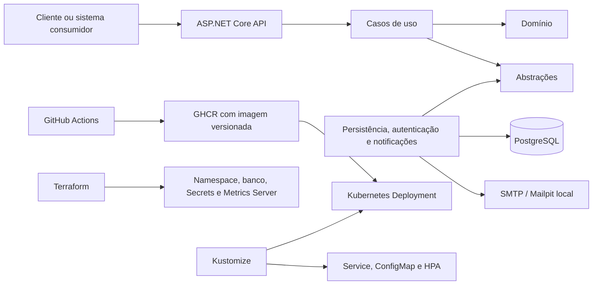

# Tech Challenge - Oficina Mecânica - Fase 2

API desenvolvida para a **Pós-Tech FIAP**, evoluindo o projeto da Fase 1. O
sistema administra clientes, veículos, serviços, produtos, estoque e todo o
ciclo de vida das Ordens de Serviço (OS).

A Fase 2 concentra-se em evolução da arquitetura, APIs operacionais, controle de
estoque, testes automatizados, conteinerização, Kubernetes, Terraform e CI/CD.

> **Status verificado em 01/09/2026:** build sem erros ou avisos, 118 testes
> unitários, 30 testes de integração e 4 testes Terraform aprovados. Docker,
> Kubernetes e Terraform foram validados no ambiente local. O acompanhamento
> detalhado está no [checklist de entregáveis](docs/fase-2-entregaveis.md).

## Entregáveis da Fase 2

| Área | Estado verificado |
| --- | --- |
| Arquitetura em camadas e testes | Concluído para o escopo da fase |
| Clean Code | Concluído: fluxo assíncrono propagado dos endpoints aos repositórios |
| APIs obrigatórias da OS | Concluído, incluindo webhook e e-mail local |
| Estoque e categorias | Concluído |
| Docker e Docker Compose | Concluído e validado |
| Kubernetes local | Concluído e validado |
| Terraform local | Concluído e validado sobre cluster Docker Desktop existente |
| CI: build, testes e imagem | Concluído |
| CD para o cluster local | Concluído: Terraform e aplicação por Kustomize validados |
| Vídeo e documento final | Pendente |

No ambiente acadêmico adotado pelo grupo, o GitHub Actions termina com a
publicação da imagem validada no GHCR e a etapa de entrega é executada no cluster
local do Docker Desktop com Terraform e Kustomize. Não existe ambiente remoto de
deploy. A decisão externa do orçamento é recebida por webhook autenticado e
idempotente. As mudanças de status são persistidas em uma outbox e enviadas por
SMTP; no ambiente acadêmico, o Mailpit recebe e exibe os e-mails sem exigir
infraestrutura externa. Os únicos entregáveis materiais pendentes são a
gravação/publicação do vídeo, a inclusão do link e a geração do PDF final.

## Funcionalidades principais

- cadastro de clientes, veículos, funcionários, serviços e produtos;
- categorias de produto, serviço e veículo;
- autenticação JWT, refresh token e autorização por perfil;
- abertura da OS com cliente, veículo, serviços e produtos;
- diagnóstico, orçamento, aprovação, execução, finalização e entrega;
- aprovação ou recusa externa com API key, correlação e idempotência;
- notificação de mudanças de status por e-mail com outbox e retentativa;
- consulta exclusiva de status e acompanhamento público da OS;
- fila operacional priorizada por estado e data;
- entrada, consulta e baixa de estoque sem permitir saldo negativo;
- concorrência otimista nas alterações de estoque;
- cálculo do tempo médio de execução das Ordens de Serviço.

Fluxo principal da OS:

```text
Recebida -> Em diagnóstico -> Aguardando aprovação -> Em execução -> Finalizada -> Entregue
```

## Arquitetura

O projeto utiliza um monólito organizado em camadas, com o domínio isolado dos
detalhes de API, autenticação e persistência.



| Projeto | Responsabilidade |
| --- | --- |
| `TechChallenge.Api` | Endpoints, contratos HTTP, Swagger, saúde e middleware |
| `TechChallenge.Application` | Casos de uso, comandos e validações |
| `TechChallenge.Application.Abstractions` | Interfaces e portas da aplicação |
| `TechChallenge.Domain` | Entidades, estados e regras de negócio |
| `TechChallenge.Infrastructure.*` | PostgreSQL, EF Core, autenticação, SMTP/outbox e injeção de dependências |
| `TechChallenge.Tests` | Testes unitários |
| `TechChallenge.IntegrationTests` | Testes de integração HTTP |

Tecnologias principais: **.NET 10**, ASP.NET Core Minimal APIs, Entity Framework
Core, PostgreSQL, JWT, FluentValidation, xUnit, Docker, Kubernetes, Terraform e
GitHub Actions.

A arquitetura completa, os recursos provisionados e o fluxo de deploy estão em
[Arquitetura da Fase 2](docs/arquitetura-fase-2.md).

## APIs

Todas as rotas usam o prefixo `/api/v1`. A especificação completa fica disponível
pelo Swagger quando a aplicação está em execução:

- local: [http://localhost:5020/swagger](http://localhost:5020/swagger);
- Docker: [http://localhost:8080/swagger](http://localhost:8080/swagger);
- Kubernetes por port-forward: [http://localhost:18080/swagger](http://localhost:18080/swagger);
- OpenAPI JSON: `/openapi/v1.json`.

Rotas centrais da Fase 2:

| Método | Rota | Finalidade |
| --- | --- | --- |
| `POST` | `/api/v1/ordens-servico` | Abrir OS com cliente, veículo, serviços e produtos |
| `GET` | `/api/v1/ordens-servico/{id}/status` | Consultar o status da OS |
| `GET` | `/api/v1/ordens-servico/oficina` | Consultar a fila operacional priorizada |
| `GET` | `/api/v1/ordens-servico/acompanhamento/{codigo}` | Acompanhamento público da OS |
| `POST` | `/api/v1/integracoes/orcamentos/respostas` | Receber aprovação ou recusa externa idempotente |
| `POST` | `/api/v1/estoque` | Adicionar quantidade ao estoque |
| `GET` | `/api/v1/estoque/{produtoId}` | Consultar saldo por produto |
| `PUT` | `/api/v1/estoque` | Efetuar baixa no estoque |

Os CRUDs de clientes, veículos, funcionários, serviços, produtos, categorias e
usuários estão documentados no Swagger. Por padrão, as rotas exigem autenticação;
login, refresh, OpenAPI, saúde e acompanhamento público são exceções explícitas.
O webhook externo não usa o JWT interno: ele exige o cabeçalho
`X-Integration-Key`.

## Execução local

### Pré-requisitos

- .NET SDK 10;
- PostgreSQL;
- Git;
- Docker Desktop para execução conteinerizada e Kubernetes local.

Clone e acesse o projeto:

```bash
git clone https://github.com/louistx/fiap-tech-challenge.git
cd fiap-tech-challenge
```

Configure conexão, JWT e senha do usuário inicial por User Secrets ou variáveis
de ambiente. Exemplo para o terminal local:

```bash
export ConnectionStrings__DefaultConnection="Host=localhost;Port=5432;Database=TechChallenge;Username=postgres;Password=SUA_SENHA"
export Jwt__SecretKey="troque-por-uma-chave-com-mais-de-32-caracteres"
export Seed__AdminPassword="SenhaAdmin123"
```

Depois, restaure, compile e execute:

```bash
dotnet restore TechChallenge.slnx
dotnet build TechChallenge.slnx --no-restore
dotnet run --project src/TechChallenge.Api/TechChallenge.Api.csproj
```

A API será exposta em `http://localhost:5020`. As migrations são aplicadas na
inicialização, exceto no ambiente `Testing`.

## Docker

Suba a API, o PostgreSQL e o Mailpit:

```bash
docker compose \
  -f docker-compose/docker-compose.yml \
  -f docker-compose/docker-compose.override.yml \
  up --build
```

A API ficará em `http://localhost:8080`, o Mailpit em
`http://localhost:8025` e o PostgreSQL em `localhost:5432`. A coleção de
requisições pronta para apresentação está em
[docs/demo/fase-2](docs/demo/fase-2/README.md).

Para encerrar:

```bash
docker compose \
  -f docker-compose/docker-compose.yml \
  -f docker-compose/docker-compose.override.yml \
  down
```

O Dockerfile usa múltiplos estágios e usuário não-root. O workflow publica a
imagem para `linux/amd64`, com `latest`, uma tag formada pelos 12 primeiros
caracteres do SHA e o SHA completo no rótulo OCI. No Docker Desktop em Apple
Silicon, essa imagem é executada por emulação.

## Testes

```bash
dotnet test tests/TechChallenge.Tests/TechChallenge.Tests.csproj
dotnet test tests/TechChallenge.IntegrationTests/TechChallenge.IntegrationTests.csproj
terraform -chdir=infra/environments/local test
```

Última validação registrada:

- 118 testes unitários aprovados;
- 30 testes de integração aprovados;
- 4 testes Terraform aprovados;
- build sem erros ou avisos;
- imagem Docker `linux/amd64` publicada e validada localmente.

Estratégia, cenários e limitações: [docs/testes.md](docs/testes.md).

## Kubernetes e Terraform

O cluster Kubernetes é fornecido pelo Docker Desktop. O Terraform não cria o
cluster; ele administra o namespace `techchallenge`, PostgreSQL, Service interno,
PVC, Secrets e Metrics Server. O Kustomize administra ConfigMap, Deployment,
Service e HPA da API.

Prepare e valide a infraestrutura:

```bash
cp infra/environments/local/terraform.tfvars.example \
  infra/environments/local/terraform.tfvars

terraform -chdir=infra/environments/local init
terraform -chdir=infra/environments/local fmt -check -recursive
terraform -chdir=infra/environments/local validate
terraform -chdir=infra/environments/local test
terraform -chdir=infra/environments/local plan -out=local.tfplan
terraform -chdir=infra/environments/local apply local.tfplan
```

Implante a aplicação com um único apply do overlay:

```bash
kubectl --context=docker-desktop apply -k k8s/overlays/docker-local
kubectl --context=docker-desktop -n techchallenge rollout status \
  deployment/fiap-tech-challenge-api --timeout=300s
kubectl --context=docker-desktop -n techchallenge get pods,svc,pvc,hpa
```

O HPA controla a API entre uma e três réplicas, com alvo de 70% de CPU. Os
endpoints `/health/live` e `/health/ready` são utilizados pelas probes.

Instruções de credenciais, persistência, backup, teste de carga e recuperação:
[infra/README.md](infra/README.md) e [k8s/README.md](k8s/README.md).

## CI/CD

| Workflow | Responsabilidade |
| --- | --- |
| `build.yml` | Restore e build |
| `unit-tests.yml` | Testes unitários |
| `integration-tests.yml` | Testes de integração |
| `docker-image.yml` | Gate de build/testes e publicação `linux/amd64` no GHCR |

O workflow da imagem só publica depois que build e as duas suítes são aprovados.
A entrega contínua do ambiente acadêmico é concluída no cluster Kubernetes local:
o Terraform prepara banco e dependências, e um único `kubectl apply -k` aplica a
API com a imagem publicada. O runner hospedado não precisa acessar a máquina do
desenvolvedor, pois não existe um ambiente remoto neste trabalho.

## Segurança

- JWT Bearer e refresh token com rotação e revogação;
- hash de senha com PBKDF2;
- perfis `Administrador`, `Vendedor` e `Mecanico`;
- autenticação obrigatória por padrão;
- usuário não-root no container;
- segredos gerados pelo Terraform e fora do Git;
- respostas de erro padronizadas;
- relatório de vulnerabilidades em [docs/relatorio-vulnerabilidades.md](docs/relatorio-vulnerabilidades.md).

## Documentação e entrega

| Documento | Conteúdo |
| --- | --- |
| [Checklist da Fase 2](docs/fase-2-entregaveis.md) | Progresso, evidências e pendências |
| [Arquitetura da Fase 2](docs/arquitetura-fase-2.md) | Componentes, infraestrutura e deploy |
| [Validação da infraestrutura](docs/validacao-infra-local.md) | Evidências de Terraform, Kubernetes, saúde, persistência e HPA |
| [Auditoria do Estoque](docs/auditoria-estoque.md) | Contratos, regras, persistência e testes |
| [DDD](docs/ddd.md) | Domínio e agregado de Ordem de Serviço |
| [Event Storming](docs/event-storming.md) | Eventos, comandos e fluxos do negócio |
| [Roteiro do vídeo](docs/roteiro-video-fase-2.md) | Demonstração cronometrada de até 15 minutos |
| [Demo executável](docs/demo/fase-2/README.md) | Requests HTTP do fluxo, webhook e Mailpit |
| [Documento final](docs/entrega-fase-2.md) | Fonte da entrega no portal |

Antes da entrega final ainda é necessário publicar o vídeo, inserir seu link e
gerar e revisar o PDF. O repositório já está compartilhado com
`soat-architecture` com permissão de escrita.

## Equipe

| Participante | RM | GitHub |
| --- | --- | --- |
| Gabriel Teixeira | RM374752 | [@louistx](https://github.com/louistx) |
| Brunno de Oliveira | RM374818 | [@DevDoubleN](https://github.com/DevDoubleN) |
| Luís Henrique | RM374786 | [@Ace0777](https://github.com/Ace0777) |
| Caio Montilha | RM375494 | [@cmontilha](https://github.com/cmontilha) |
| Gustavo Keiji | RM374965 | [@GuKeiji](https://github.com/GuKeiji) |

Repositório: [github.com/louistx/fiap-tech-challenge](https://github.com/louistx/fiap-tech-challenge)

Projeto acadêmico desenvolvido para o **Tech Challenge da Pós-Tech FIAP**.
