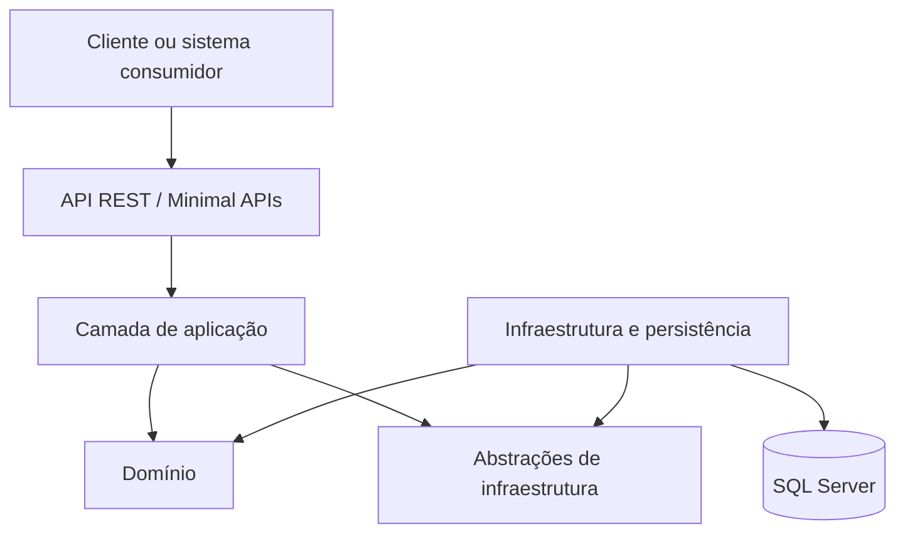

# Tech Challenge — Sistema de Gestão para Oficina Mecânica

Projeto desenvolvido para a **Pós-Tech da FIAP**, como parte do Tech Challenge da Fase 1.

O objetivo é construir o MVP do back-end de um sistema integrado para uma oficina mecânica, centralizando o cadastro de clientes e veículos, o controle das Ordens de Serviço, a elaboração de orçamentos, a gestão do inventário e o acompanhamento da execução dos serviços.

> **Status do projeto:** em desenvolvimento. O repositório possui a estrutura inicial da API, entidades de domínio, configurações do Entity Framework Core, migrations e contratos de endpoints. Algumas operações ainda retornam dados simulados e funcionalidades como autenticação, transições completas da OS, notificações e controle efetivo de estoque permanecem no roadmap.

## Sumário

- [Contexto do desafio](#contexto-do-desafio)
- [Objetivos](#objetivos)
- [Escopo funcional](#escopo-funcional)
- [Fluxo principal da Ordem de Serviço](#fluxo-principal-da-ordem-de-serviço)
- [Domain-Driven Design](#domain-driven-design)
- [Arquitetura](#arquitetura)
- [Tecnologias](#tecnologias)
- [Estrutura do repositório](#estrutura-do-repositório)
- [Estado atual da implementação](#estado-atual-da-implementação)
- [Endpoints](#endpoints)
- [Como executar localmente](#como-executar-localmente)
- [Execução com Docker](#execução-com-docker)
- [Banco de dados](#banco-de-dados)
- [Testes](#testes)
- [Segurança](#segurança)
- [Documentação](#documentação)
- [Roadmap](#roadmap)
- [Equipe](#equipe)

## Contexto do desafio

A oficina mecânica utilizada como cenário do projeto realiza seus processos de atendimento, diagnóstico, execução e entrega por meio de anotações manuais e planilhas.

Essa operação descentralizada pode causar:

- erros na priorização dos atendimentos;
- falhas no controle de peças e insumos;
- dificuldade para acompanhar o estado dos serviços;
- perda do histórico de clientes e veículos;
- ineficiência na geração e aprovação de orçamentos;
- dificuldade para medir o tempo de execução dos serviços.

Como solução, o projeto propõe um **Sistema Integrado de Atendimento e Execução de Serviços**, oferecendo uma API para a operação da oficina e para o acompanhamento das Ordens de Serviço pelos clientes.

## Objetivos

O objetivo principal é desenvolver a primeira versão do back-end da oficina utilizando um monólito organizado em camadas e orientado pelos princípios de Domain-Driven Design.

O sistema deverá:

- centralizar os dados de clientes, veículos, funcionários, serviços e produtos;
- controlar todo o ciclo de vida de uma Ordem de Serviço;
- permitir a elaboração e aprovação de orçamentos;
- controlar a disponibilidade e o consumo de peças;
- manter o histórico do atendimento;
- disponibilizar o andamento da OS por API;
- oferecer documentação interativa com Swagger;
- permitir execução local e conteinerizada;
- aplicar validações, autenticação e testes automatizados nos fluxos críticos.

## Escopo funcional

### Clientes

- identificação por CPF ou CNPJ;
- cadastro, consulta, atualização e exclusão;
- armazenamento de dados pessoais e endereço;
- consulta do histórico de Ordens de Serviço.

### Veículos

- cadastro de placa, marca, modelo e ano;
- associação do veículo ao cliente responsável;
- validação de placa e identificação de cadastros existentes;
- manutenção do histórico de atendimentos.

### Serviços

- cadastro dos serviços oferecidos pela oficina;
- definição do valor de cada serviço;
- inclusão de serviços no diagnóstico e no orçamento.

### Peças e insumos

- cadastro de produtos utilizados pela oficina;
- controle de preço e quantidade disponível;
- verificação de estoque antes do envio do orçamento;
- baixa de estoque durante a execução.

### Ordens de Serviço

- criação da OS a partir do cliente e do veículo;
- registro do problema relatado e das observações;
- atribuição da OS a um mecânico;
- registro do diagnóstico;
- inclusão de serviços, peças e insumos;
- cálculo do orçamento;
- envio para aprovação do cliente;
- acompanhamento das mudanças de estado;
- conclusão técnica, pagamento e entrega do veículo.

### Gestão administrativa

- CRUD dos principais cadastros;
- listagem e detalhamento das Ordens de Serviço;
- visualização das OS disponíveis para a oficina;
- acompanhamento do tempo médio de execução;
- controle do encerramento administrativo.

## Fluxo principal da Ordem de Serviço

O fluxo de negócio levantado durante o Event Storming é:

```text
Cliente e veículo identificados
  ↓
Ordem de Serviço criada
  ↓
Recebida
  ↓
Em diagnóstico
  ↓
Orçamento calculado
  ↓
Aguardando aprovação
  ↓
Aprovada
  ↓
Em execução
  ↓
Execução concluída
  ↓
Inspeção e pagamento
  ↓
Veículo liberado e entregue
  ↓
Finalizada
```

Além do fluxo principal, o domínio considera cenários alternativos como:

- falta de produtos no estoque;
- aprovação parcial do orçamento;
- reprovação ou negociação de valores;
- identificação de serviços adicionais;
- compra externa de materiais;
- retorno da OS para retrabalho.

## Domain-Driven Design

O projeto utiliza DDD para representar o negócio da oficina a partir de sua linguagem e de suas regras.

### Linguagem ubíqua

| Termo | Significado |
| --- | --- |
| Cliente | Pessoa responsável pelo veículo e pela aprovação do orçamento |
| Veículo | Automóvel associado ao cliente e à Ordem de Serviço |
| Ordem de Serviço | Registro central do atendimento realizado pela oficina |
| Diagnóstico | Análise que identifica serviços e produtos necessários |
| Orçamento | Composição dos serviços, produtos, quantidades e valores |
| Serviço | Atividade técnica realizada pela oficina |
| Produto | Peça ou insumo utilizado na execução |
| Mecânico | Funcionário responsável pelo diagnóstico e pela execução |
| Administrador | Funcionário responsável pela gestão e pelo encerramento da OS |

### Agregado principal

A `OrdemServico` é o principal candidato a raiz de agregado. Ela coordena:

- cliente e veículo atendidos;
- funcionário responsável;
- descrição do problema;
- serviços e produtos;
- datas de criação, atualização e finalização;
- estado atual da execução;
- regras de transição entre os estados.

### Contextos identificados

- **Atendimento:** identificação do cliente, cadastro do veículo e abertura da OS.
- **Oficina:** atribuição do mecânico, diagnóstico e execução.
- **Orçamento:** cálculo, apresentação e aprovação dos itens.
- **Inventário:** disponibilidade, reserva e baixa de produtos.
- **Pagamento:** confirmação do valor final e geração do recibo.
- **Notificações:** comunicação com cliente, mecânico e administrador.

A documentação detalhada está disponível em:

- [Documentação DDD](docs/ddd.md)
- [Event Storming](docs/event-storming.md)
- [Requisitos funcionais](docs/requisitos.md)

## Arquitetura

O MVP foi estruturado como um **monólito em camadas**.



### Responsabilidades das camadas

| Camada | Responsabilidade |
| --- | --- |
| `TechChallenge.Api` | Endpoints REST, contratos HTTP, Swagger e middleware |
| `TechChallenge.Application` | Casos de uso, comandos e coordenação dos fluxos |
| `TechChallenge.Application.Abstractions` | Contratos da camada de aplicação |
| `TechChallenge.Domain` | Entidades, enums e regras centrais do negócio |
| `TechChallenge.Infrastructure.Abstractions` | Contratos dos repositórios |
| `TechChallenge.Infrastructure.Database` | Entity Framework Core, contexto, configurações, migrations e repositórios |
| `TechChallenge.Infrastructure.IoC` | Registro de dependências e composição da infraestrutura |
| `TechChallenge.Tests` | Testes unitários |
| `TechChallenge.IntegrationTests` | Testes de integração |

## Tecnologias

- **C#**
- **.NET 10**
- **ASP.NET Core Minimal APIs**
- **Entity Framework Core 10**
- **SQL Server**
- **Swagger / OpenAPI**
- **xUnit**
- **Coverlet**
- **Docker**
- **Docker Compose**
- **GitHub Actions**

## Estrutura do repositório

```text
.
├── .github/
│   └── workflows/                     # Automações do GitHub Actions
├── docker-compose/                    # Orquestração dos containers
├── docs/
│   ├── assets/                        # Diagramas e imagens
│   ├── ddd.md                         # Documentação de DDD
│   ├── event-storming.md              # Documentação do Event Storming
│   └── requisitos.md                  # Requisitos funcionais
├── src/
│   ├── TechChallenge.Api/             # API REST
│   ├── TechChallenge.Application/     # Casos de uso
│   ├── TechChallenge.Application.Abstractions/
│   ├── TechChallenge.Domain/          # Entidades de domínio
│   └── TechChallenge.Infrastructure.Database/
├── TechChallenge.Infrastructure.Abstractions/
├── TechChallenge.Infrastructure.IoC/
├── tests/
│   ├── TechChallenge.Tests/
│   └── TechChallenge.IntegrationTests/
└── TechChallenge.slnx
```

## Estado atual da implementação

Esta seção diferencia os requisitos do produto do que já está efetivamente disponível no código.

| Funcionalidade | Estado |
| --- | --- |
| Estrutura da solução em camadas | Implementada |
| Entidades principais do domínio | Implementadas inicialmente |
| Configurações do Entity Framework Core | Implementadas inicialmente |
| Migration inicial | Disponível |
| Middleware global de exceções | Implementado inicialmente |
| Contratos HTTP de clientes | Disponíveis |
| Contratos HTTP de veículos | Disponíveis |
| Contratos HTTP de funcionários | Disponíveis |
| Contratos HTTP de serviços | Disponíveis |
| Contratos HTTP de produtos | Disponíveis |
| Contratos HTTP de Ordens de Serviço | Disponíveis |
| Persistência completa dos endpoints | Em desenvolvimento |
| Estados e transições da OS | Em desenvolvimento |
| Geração e aprovação do orçamento | Planejada |
| Controle efetivo de estoque | Planejado |
| Notificações ao cliente | Planejadas |
| Autenticação JWT | Planejada |
| Validação completa de CPF, CNPJ e placa | Planejada |
| Monitoramento do tempo médio | Planejado |
| Testes dos fluxos críticos | Estrutura criada; cenários ainda pendentes |
| Cobertura mínima de 80% | Ainda não atingida |

> Os endpoints atuais servem como contratos iniciais da API. Parte deles retorna identificadores gerados, objetos de exemplo ou listas vazias e ainda precisa ser integrada aos casos de uso e repositórios.

## Endpoints

Todos os endpoints utilizam o prefixo `/api/v1`.

### Clientes

| Método | Rota | Descrição |
| --- | --- | --- |
| `POST` | `/api/v1/clientes` | Cadastra um cliente |
| `GET` | `/api/v1/clientes` | Lista os clientes |
| `GET` | `/api/v1/clientes/{id}` | Consulta um cliente |
| `PUT` | `/api/v1/clientes/{id}` | Atualiza um cliente |
| `DELETE` | `/api/v1/clientes/{id}` | Exclui um cliente |

### Veículos

| Método | Rota | Descrição |
| --- | --- | --- |
| `POST` | `/api/v1/veiculos` | Cadastra um veículo |
| `GET` | `/api/v1/veiculos` | Lista os veículos |
| `GET` | `/api/v1/veiculos/{id}` | Consulta um veículo |
| `PUT` | `/api/v1/veiculos/{id}` | Atualiza um veículo |
| `DELETE` | `/api/v1/veiculos/{id}` | Exclui um veículo |

### Funcionários

| Método | Rota | Descrição |
| --- | --- | --- |
| `POST` | `/api/v1/funcionarios` | Cadastra um funcionário |
| `GET` | `/api/v1/funcionarios` | Lista os funcionários |
| `GET` | `/api/v1/funcionarios/{id}` | Consulta um funcionário |
| `PUT` | `/api/v1/funcionarios/{id}` | Atualiza um funcionário |
| `DELETE` | `/api/v1/funcionarios/{id}` | Exclui um funcionário |

### Serviços

| Método | Rota | Descrição |
| --- | --- | --- |
| `POST` | `/api/v1/servicos` | Cadastra um serviço |
| `GET` | `/api/v1/servicos` | Lista os serviços |
| `GET` | `/api/v1/servicos/{id}` | Consulta um serviço |
| `PUT` | `/api/v1/servicos/{id}` | Atualiza um serviço |
| `DELETE` | `/api/v1/servicos/{id}` | Exclui um serviço |

### Produtos e inventário

| Método | Rota | Descrição |
| --- | --- | --- |
| `POST` | `/api/v1/produtos` | Cadastra um produto |
| `GET` | `/api/v1/produtos` | Lista o inventário |
| `GET` | `/api/v1/produtos/{id}` | Consulta um produto |
| `PUT` | `/api/v1/produtos/{id}` | Atualiza um produto |
| `DELETE` | `/api/v1/produtos/{id}` | Exclui um produto |

### Ordens de Serviço

| Método | Rota | Descrição |
| --- | --- | --- |
| `POST` | `/api/v1/ordens-servico` | Cria uma OS |
| `GET` | `/api/v1/ordens-servico` | Lista as Ordens de Serviço |
| `GET` | `/api/v1/ordens-servico/{id}` | Consulta uma OS |
| `GET` | `/api/v1/ordens-servico/oficina` | Lista as OS destinadas à visualização da oficina |
| `PUT` | `/api/v1/ordens-servico/{id}` | Atualiza uma OS |
| `PATCH` | `/api/v1/ordens-servico/{id}/atribuir` | Atribui a OS a um mecânico |
| `PATCH` | `/api/v1/ordens-servico/{id}/diagnostico` | Registra serviços e produtos do diagnóstico |
| `DELETE` | `/api/v1/ordens-servico/{id}` | Exclui uma OS |

## Como executar localmente

### Pré-requisitos

- [.NET SDK 10](https://dotnet.microsoft.com/download/dotnet/10.0)
- Git
- Docker Desktop, caso utilize containers
- SQL Server, para executar a persistência quando a integração estiver habilitada

### 1. Clonar o repositório

```bash
git clone https://github.com/louistx/fiap-tech-challenge.git
cd fiap-tech-challenge
```

### 2. Restaurar as dependências da API

```bash
dotnet restore src/TechChallenge.Api/TechChallenge.Api.csproj
```

### 3. Configurar a conexão com o banco

Não mantenha usuário e senha reais no `appsettings.json`. Para desenvolvimento local, utilize User Secrets:

```bash
dotnet user-secrets set \
  "ConnectionStrings:DefaultConnection" \
  "Server=localhost,1433;Database=TechChallenge;User Id=sa;Password=SUA_SENHA;TrustServerCertificate=True" \
  --project src/TechChallenge.Api/TechChallenge.Api.csproj
```

Também é possível utilizar a variável de ambiente:

```bash
export ConnectionStrings__DefaultConnection="Server=localhost,1433;Database=TechChallenge;User Id=sa;Password=SUA_SENHA;TrustServerCertificate=True"
```

### 4. Compilar a API

```bash
dotnet build src/TechChallenge.Api/TechChallenge.Api.csproj --no-restore
```

### 5. Executar a API

```bash
dotnet run --project src/TechChallenge.Api/TechChallenge.Api.csproj
```

Pelo perfil HTTP local, a aplicação utiliza:

```text
http://localhost:5020
```

### 6. Acessar a documentação da API

Com a aplicação em execução:

- Swagger UI: [http://localhost:5020/swagger](http://localhost:5020/swagger)
- OpenAPI JSON: [http://localhost:5020/openapi/v1.json](http://localhost:5020/openapi/v1.json)

### Validar a solução completa

Após restaurar todos os projetos, a solução completa pode ser validada com:

```bash
dotnet restore TechChallenge.slnx
dotnet build TechChallenge.slnx --no-restore
```

> Alguns projetos de aplicação e infraestrutura ainda estão sendo integrados. Enquanto essa consolidação não for concluída, a compilação completa pode apontar implementações pendentes que não impedem a execução isolada da API.

## Execução com Docker

O repositório possui `Dockerfile` e arquivos de Docker Compose para a API. O comando previsto para subir o ambiente é:

A partir da raiz:

```bash
docker compose \
  -f docker-compose/docker-compose.yml \
  -f docker-compose/docker-compose.override.yml \
  up --build
```

A API é exposta em:

```text
http://localhost:8080
```

Para encerrar:

```bash
docker compose \
  -f docker-compose/docker-compose.yml \
  -f docker-compose/docker-compose.override.yml \
  down
```

> **Limitação atual:** o Docker Compose contém somente a API. O serviço do SQL Server e sua configuração de conexão ainda precisam ser adicionados para que o ambiente completo seja iniciado por um único comando. O fluxo de build do container também precisa ser validado após a consolidação das referências entre os projetos; portanto, a execução direta com `dotnet run` é o caminho principal no estado atual.

## Banco de dados

O projeto utiliza **SQL Server** por meio do Entity Framework Core.

### Justificativa

O SQL Server foi escolhido porque:

- possui integração oficial com .NET e Entity Framework Core;
- oferece transações e integridade referencial para os dados da OS;
- atende bem aos relacionamentos entre clientes, veículos, funcionários, serviços e produtos;
- permite migrations versionadas junto ao código;
- pode ser executado localmente ou em container.

O repositório já contém:

- `ApplicationDbContext`;
- mapeamentos das entidades;
- repositórios iniciais;
- migration inicial;
- factory para operações de design time.

Para trabalhar com migrations, instale a ferramenta do Entity Framework caso ela ainda não esteja disponível:

```bash
dotnet tool install --global dotnet-ef
```

Exemplo de atualização do banco:

```bash
dotnet ef database update \
  --project src/TechChallenge.Infrastructure.Database/TechChallenge.Infrastructure.Database.csproj \
  --startup-project src/TechChallenge.Api/TechChallenge.Api.csproj
```

## Testes

O projeto utilizará o **xUnit** como framework para criação e execução dos testes automatizados em .NET.

Os testes serão organizados em dois projetos:

- `TechChallenge.Tests`: testes unitários das entidades, regras de domínio e serviços de aplicação;
- `TechChallenge.IntegrationTests`: testes de integração da API, banco de dados, repositórios e fluxos completos.

Entre os principais cenários que deverão ser testados estão:

- cadastro e validação de clientes e veículos;
- criação e consulta de Ordens de Serviço;
- atribuição de uma OS a um mecânico;
- mudanças válidas e inválidas de estado da OS;
- registro do diagnóstico;
- cálculo e aprovação do orçamento;
- verificação e baixa de produtos no estoque;
- tratamento de erros e respostas HTTP da API.

Para executar todos os testes:

```bash
dotnet test TechChallenge.slnx
```

Para executar somente os testes unitários:

```bash
dotnet test tests/TechChallenge.Tests/TechChallenge.Tests.csproj
```

Para executar os testes de integração:

```bash
dotnet test tests/TechChallenge.IntegrationTests/TechChallenge.IntegrationTests.csproj
```

Para coletar cobertura:

```bash
dotnet test TechChallenge.slnx \
  --collect:"XPlat Code Coverage"
```

O **Coverlet** será utilizado em conjunto com o xUnit para medir a cobertura dos testes.

> **Situação atual:** os projetos de teste e as dependências do xUnit já foram criados, mas os testes dos fluxos de negócio ainda não foram implementados. A meta do desafio é atingir pelo menos 80% de cobertura nos domínios críticos.

## Segurança

O escopo de segurança do projeto inclui:

- autenticação JWT para endpoints administrativos;
- autorização por perfil de funcionário;
- validação de CPF, CNPJ e placa;
- proteção dos segredos de conexão;
- tratamento padronizado de exceções;
- análise de vulnerabilidades das dependências e do código.

O middleware de exceções já possui uma estrutura inicial. Autenticação, autorização e validações completas ainda precisam ser implementadas.

Para verificar dependências vulneráveis:

```bash
dotnet list TechChallenge.slnx package --vulnerable --include-transitive
```

Para auditar as imagens Docker, pode ser utilizada uma ferramenta como Trivy:

```bash
trivy image techchallengeapi
```

Os resultados relevantes devem ser registrados no relatório de vulnerabilidades solicitado como entregável da fase.

## Documentação

| Documento | Conteúdo |
| --- | --- |
| [Índice da documentação](docs/README.md) | Acesso central aos documentos |
| [DDD](docs/ddd.md) | Domínio, agregado, estados, comandos e relação com o código |
| [Event Storming](docs/event-storming.md) | Fluxos, eventos, políticas e pontos de decisão |
| [Requisitos funcionais](docs/requisitos.md) | Levantamento inicial dos requisitos |
| [Quadro no Figma](https://www.figma.com/board/RDxPpsRgOD8J3wvPTh2659/Untitled?node-id=0-1&p=f) | Event Storming colaborativo |

## Roadmap

- [x] Estruturar a solução .NET.
- [x] Criar os projetos de domínio, aplicação, API e infraestrutura.
- [x] Modelar as entidades iniciais.
- [x] Configurar o Entity Framework Core e a migration inicial.
- [x] Criar os contratos iniciais dos endpoints.
- [x] Documentar DDD e Event Storming.
- [ ] Consolidar referências e injeção de dependências entre as camadas.
- [ ] Integrar todos os endpoints aos casos de uso e repositórios.
- [ ] Modelar os estados e as regras de transição da OS.
- [ ] Implementar orçamento e aprovação do cliente.
- [ ] Implementar aprovação parcial, reprovação e negociação.
- [ ] Implementar controle, reserva e baixa de estoque.
- [ ] Implementar autenticação e autorização JWT.
- [ ] Implementar validações de CPF, CNPJ e placa.
- [ ] Implementar notificações.
- [ ] Implementar pagamento, recibo e entrega.
- [ ] Adicionar SQL Server ao Docker Compose.
- [ ] Implementar testes unitários e de integração.
- [ ] Atingir cobertura mínima de 80% nos fluxos críticos.
- [ ] Executar e documentar a análise de vulnerabilidades.

## Equipe

| Participante | RM | GitHub |
| --- | --- | --- |
| Gabriel Teixeira | RM374752 | [@louistx](https://github.com/louistx) |
| Brunno de Oliveira | A informar | [@DevDoubleN](https://github.com/DevDoubleN) |
| Luís Henrique | A informar | [@Ace0777](https://github.com/Ace0777) |
| Caio Montilha | RM375494 | [@cmontilha](https://github.com/cmontilha) |
| Gustavo Keiji | A informar | A informar |

## Repositório

[github.com/louistx/fiap-tech-challenge](https://github.com/louistx/fiap-tech-challenge)

---

Projeto acadêmico desenvolvido para o **Tech Challenge da Pós-Tech FIAP**.
