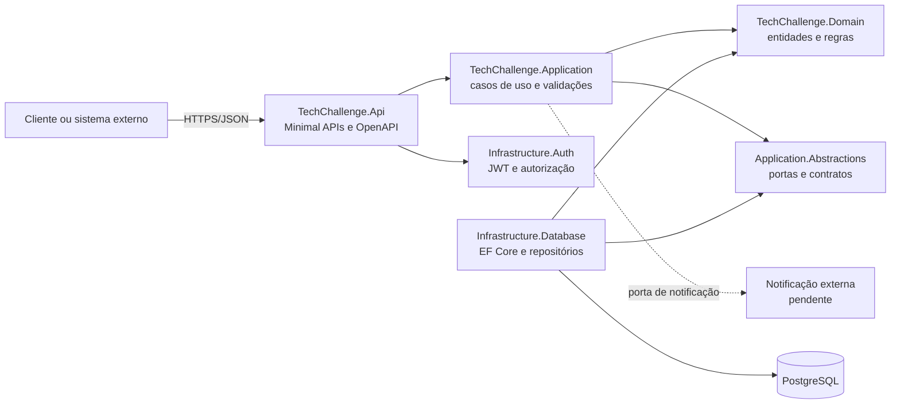
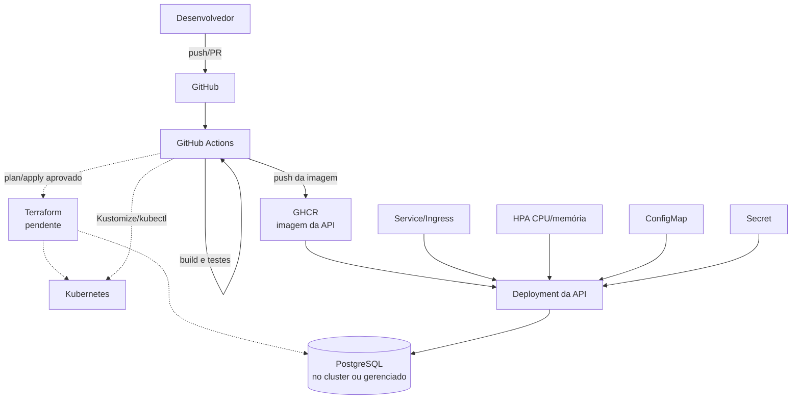

# Arquitetura Proposta - Fase 2

## Objetivo

A Fase 2 mantém o back-end como um monólito modular, mas passa a exigir separação clara de responsabilidades, conteinerização reproduzível, execução em Kubernetes, infraestrutura provisionada por Terraform e entrega automatizada.

Esta é a arquitetura-alvo. Componentes marcados como pendentes ainda não devem ser interpretados como ambiente disponível.

## Componentes da aplicação



### Regra de dependência

- `Domain` não deve depender de API, banco, autenticação ou frameworks de entrega.
- `Application` coordena casos de uso e depende do domínio e de abstrações.
- `Application.Abstractions` expõe portas para persistência, autenticação e notificações.
- Infraestruturas implementam essas portas.
- `Api` transforma HTTP em comandos/consultas e compõe as dependências.

O repositório já segue parte desse desenho, mas a auditoria encontrou chamadas síncronas sobre APIs assíncronas, regras inconsistentes de identificação no estoque, helpers duplicados e falhas de materialização do EF Core. A separação de projetos, isoladamente, não conclui a Clean Architecture.

## Infraestrutura-alvo



### Recursos esperados

| Camada | Recursos |
| --- | --- |
| Aplicação | Deployment, Service, probes, requests/limits e HPA |
| Configuração | ConfigMap para configurações não sensíveis e Secret para conexão/JWT |
| Dados | PostgreSQL gerenciado ou StatefulSet, storage persistente, backup e migration controlada |
| Rede | Service interno e, quando necessário, Ingress com TLS |
| Observabilidade | logs, métricas para HPA e health checks |
| IaC | providers, cluster, rede, banco, outputs, variáveis e estado remoto do Terraform |

## Fluxo de deploy proposto

```mermaid
sequenceDiagram
    participant Dev as Desenvolvedor
    participant GH as GitHub
    participant CI as GitHub Actions
    participant REG as GHCR
    participant TF as Terraform
    participant K8S as Kubernetes

    Dev->>GH: push ou pull request
    GH->>CI: dispara validação
    CI->>CI: restore, build e testes
    CI->>REG: build e push da imagem imutável
    CI->>TF: plan; apply com aprovação do ambiente
    TF->>K8S: garante cluster e dependências
    CI->>K8S: aplica manifests/Kustomize com tag do commit
    K8S->>K8S: rollout, probes e HPA
    CI->>CI: smoke test e registro da entrega
```

Gates mínimos: nenhum deploy quando build/testes falharem; `terraform plan` revisado antes de `apply`; segredos fora do Git; imagem identificada pelo SHA; rollout validado antes de promover o ambiente.

## Estado atual dos manifestos Kubernetes

A base pode ser renderizada com:

```bash
kubectl kustomize k8s/base
```

Isso confirma apenas a sintaxe e a composição. O Service atual possui selector diferente dos labels do Deployment, portanto não encaminhará tráfego aos pods.

O overlay local ainda não é aplicável:

```bash
kubectl kustomize k8s/overlays/docker-local
```

Ele referencia `namespace.yaml`, que não existe, e deve ser completado antes do uso. ConfigMap, Secret, HPA, banco, probes e recursos de CPU/memória também não existem.

Quando essas pendências forem corrigidas, a sequência esperada será:

```bash
kubectl apply -k k8s/overlays/docker-local
kubectl rollout status deployment/fiap-tech-challenge-api-local
kubectl get pods,service,hpa -n techchallenge
```

Os nomes e o namespace acima precisam ser alinhados aos manifests finais; os comandos representam o procedimento-alvo, não uma implantação atualmente funcional.

## Provisionamento futuro com Terraform

O diretório `/infra` ainda não existe. Uma estrutura mínima recomendada é:

```text
infra/
├── modules/
│   ├── network/
│   ├── kubernetes/
│   └── database/
├── environments/
│   ├── dev/
│   └── prod/
├── versions.tf
└── README.md
```

Quando implementado, o fluxo documentado deverá ser:

```bash
terraform -chdir=infra/environments/dev init
terraform -chdir=infra/environments/dev fmt -check
terraform -chdir=infra/environments/dev validate
terraform -chdir=infra/environments/dev plan -out=tfplan
terraform -chdir=infra/environments/dev apply tfplan
```

Antes de aplicar, é obrigatório definir o provedor e a estratégia de cluster local/cloud, banco, rede, estado remoto, locking, credenciais e política de destruição. Nenhum desses comandos funcionará até que os arquivos Terraform sejam criados.

## Decisões pendentes

- provedor do cluster e do PostgreSQL;
- Ingress e terminação TLS;
- gerenciamento de segredos;
- estratégia de migration sem execução concorrente em múltiplos pods;
- métricas e limites que alimentarão o HPA;
- ambientes, aprovações e política de promoção;
- canal externo para decisão do orçamento e notificação de status;
- recuperação, backup e observabilidade.

O acompanhamento item a item está no [Checklist de Entregáveis](fase-2-entregaveis.md).
