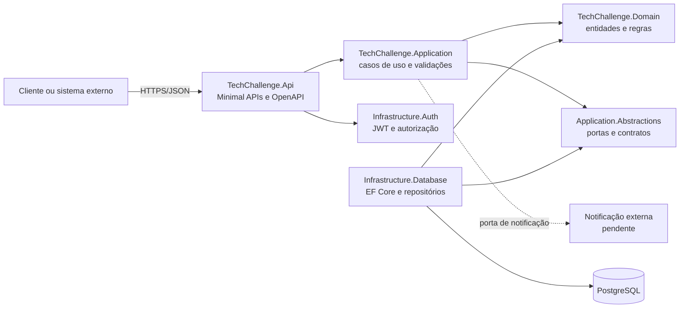
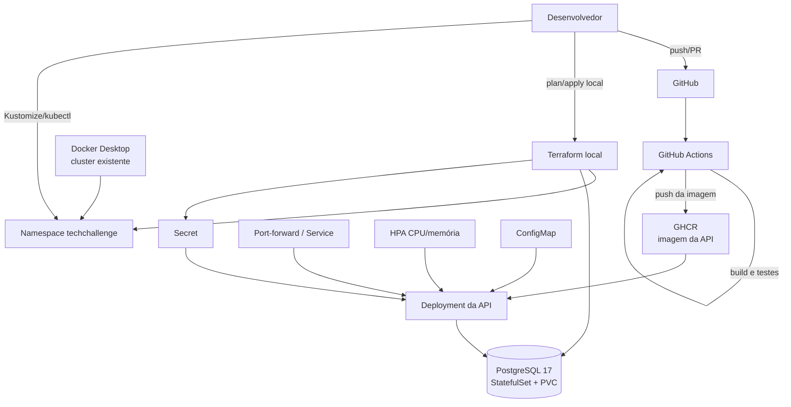

# Arquitetura Proposta - Fase 2

## Objetivo

A Fase 2 mantém o back-end como um monólito modular, mas passa a exigir separação clara de responsabilidades, conteinerização reproduzível, execução em Kubernetes, infraestrutura provisionada por Terraform e entrega automatizada.

O ambiente de entrega é o cluster local fornecido pelo Docker Desktop. O GitHub Actions valida e publica a imagem, enquanto Terraform e Kustomize concluem o CD na máquina que hospeda esse cluster. Não existe ambiente remoto neste trabalho acadêmico.

## Componentes da aplicação



### Regra de dependência

- `Domain` não deve depender de API, banco, autenticação ou frameworks de entrega.
- `Application` coordena casos de uso e depende do domínio e de abstrações.
- `Application.Abstractions` expõe portas para persistência, autenticação e notificações.
- Infraestruturas implementam essas portas.
- `Api` transforma HTTP em comandos/consultas e compõe as dependências.

O repositório segue esse desenho: identificação, materialização e helpers duplicados foram corrigidos, e o fluxo assíncrono é propagado dos endpoints aos repositórios sem bloqueios por `GetAwaiter().GetResult()`. A separação dos projetos mantém domínio e abstrações independentes dos detalhes de API, autenticação e persistência.

## Infraestrutura local



### Responsabilidades

| Camada | Recursos |
| --- | --- |
| Aplicação | Deployment, Service, probes, requests/limits e HPA |
| Configuração | ConfigMap para configurações não sensíveis e Secret para conexão/JWT |
| Dados | Terraform cria PostgreSQL em StatefulSet, Service interno e PVC; a API executa migrations no startup |
| Rede | Rede fornecida pelo Docker Desktop; Service ClusterIP e acesso local por port-forward |
| Observabilidade | logs, métricas para HPA e health checks |
| IaC | Providers Kubernetes/Helm/Random, namespace, banco, Secrets, Metrics Server, variáveis, outputs e state local |

Terraform e Kustomize não gerenciam o mesmo recurso. O namespace e os Secrets são
referenciados pelos manifests, sem uma segunda definição em YAML. O guia executável
está em [Infraestrutura local](../infra/README.md).

## Fluxo de entrega implementado

```mermaid
sequenceDiagram
    participant Dev as Desenvolvedor
    participant GH as GitHub
    participant CI as GitHub Actions
    participant REG as GHCR
    participant LOCAL as Terminal local
    participant TF as Terraform
    participant K8S as Kubernetes

    Dev->>GH: push ou pull request
    GH->>CI: dispara validação
    CI->>CI: restore, build e testes
    CI->>REG: build e push da imagem imutável
    LOCAL->>TF: plan; apply das dependências locais
    TF->>K8S: prepara dependências no cluster existente
    LOCAL->>K8S: aplica Kustomize com a tag do commit
    K8S->>K8S: rollout, probes e HPA
    LOCAL->>K8S: valida rollout e smoke test
```

Gates do fluxo: nenhuma imagem é publicada quando build/testes falharem; `terraform plan` é revisado antes de `apply`; segredos ficam fora do Git; a imagem é identificada pelo SHA; e o rollout local é validado após o apply.

Esse é o fluxo de CI/CD do projeto: CI automatizada até a publicação no GHCR e CD
reproduzível no ambiente Kubernetes local. A separação é necessária porque o
cluster Docker Desktop pertence à máquina de demonstração, não a um ambiente
remoto acessível pelo runner hospedado.

## Manifests Kubernetes

Os manifests reutilizáveis da API ficam em `k8s/base/`, incluindo um ConfigMap
vazio. O único overlay `k8s/overlays/docker-local/` preenche o ConfigMap por patch
e define o HPA desse ambiente. Para renderizar:

```bash
kubectl kustomize k8s/base
kubectl kustomize k8s/overlays/docker-local
```

O selector do Service foi alinhado aos pods. A API possui ConfigMap, referências a
Secret, startup/readiness/liveness probes e requests/limits. O HPA controla 1 a 3
réplicas por CPU. A API aplica migrations e seed antes de servir HTTP. Falhas de
inicialização encerram o processo, que o Kubernetes reinicia. Não há Job nem
etapas separadas de deploy. A renderização não substitui testes no cluster.

Após provisionar as dependências, aplique o overlay e verifique os recursos:

```bash
kubectl --context=docker-desktop apply -k k8s/overlays/docker-local
kubectl --context=docker-desktop -n techchallenge get pods,service,hpa
```

## Terraform local

```text
infra/
├── environments/
│   └── local/       # .tf, lockfile e testes mockados
└── README.md
```

O fluxo de provisionamento é:

```bash
terraform -chdir=infra/environments/local init
terraform -chdir=infra/environments/local validate
terraform -chdir=infra/environments/local test
terraform -chdir=infra/environments/local plan -out=local.tfplan
terraform -chdir=infra/environments/local apply local.tfplan
```

Leia o [guia](../infra/README.md) antes de aplicar: ele explica a configuração do
Metrics Server no Docker Desktop, o state local sensível, as credenciais geradas,
backup e proteção de namespace/PVC contra destruição. Não há ambiente de nuvem,
módulos de rede ou backend remoto nesta implementação.

## Evoluções para um eventual ambiente compartilhado

- backend remoto e locking, se houver ambiente compartilhado;
- Ingress, TLS e credenciais adequadas, se houver exposição pública;
- ambientes, aprovações e política de promoção;
- canal externo para decisão do orçamento e notificação de status;
- automatização de backup e observabilidade além dos testes locais documentados.

O acompanhamento item a item está no [Checklist de Entregáveis](fase-2-entregaveis.md).
