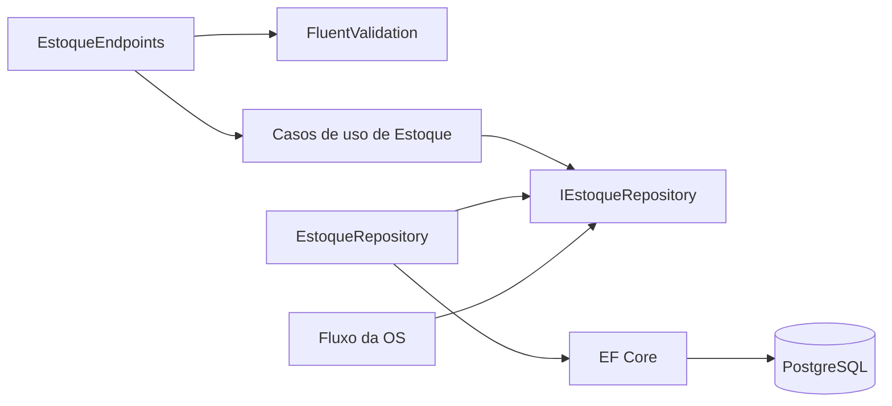

# Auditoria do Endpoint de Estoque

## Escopo

Foram revisados endpoints, contratos HTTP, comandos, validadores, serviços, entidade, acessores, repositório, configuração do Entity Framework, migrations, injeção de dependência, integração com a Ordem de Serviço e testes. A análise corresponde ao commit `3a41407`, em 25/08/2026.

## Conclusão executiva

A separação entre catálogo (`Produto`) e saldo (`Estoque`) é uma direção de domínio adequada: preço/descrição/categoria pertencem ao produto, enquanto quantidade disponível pertence ao estoque. A implementação atual, porém, não está pronta para uso. O build compila com avisos, mas o EF Core não consegue criar o modelo e todos os 20 testes de integração falham. As rotas de entrada, consulta e baixa também possuem erros funcionais.

## Fluxo implementado



## Achados por severidade

### Bloqueantes

1. **O EF Core não materializa `Estoque`.** O construtor recebe `idProduto`, mas a propriedade mapeada se chama `ProdutoId`. O erro confirmado é “No suitable constructor was found for the type 'Estoque'”. Deve-se alinhar o nome do parâmetro ou configurar explicitamente a construção, mantendo um construtor compatível com o EF.
2. **Não existe migration para o novo modelo.** `Estoque` e as categorias foram adicionados ao contexto/configurações, mas não aparecem nas migrations nem no model snapshot. Uma execução PostgreSQL não terá as tabelas/colunas necessárias.
3. **A entrada ignora a quantidade.** `AdicionarEstoqueAsync` copia apenas `ProdutoId`; `Quantidade` permanece zero e falha no validador `GreaterThan(0)`.
4. **A consulta usa verbo e binding incorretos.** O handler de obtenção está em `DELETE /{produtoId}` e recebe um parâmetro chamado `id`. A rota deve ser uma consulta `GET`, e rota/handler devem usar o mesmo nome.
5. **A baixa consulta o identificador errado.** `BaixarEstoqueService` usa `GetByIdAsync(command.ProdutoId)`, que busca o ID do registro de estoque. Para um contrato orientado a produto, deve usar `GetByIdProdutoAsync`.
6. **A atualização de produto usa uma dependência nula.** O construtor de `AtualizarItemInventarioService` recebe `IEstoqueRepository`, mas não o atribui ao campo `_estoqueRepository`; qualquer atualização chega a uma `NullReferenceException`.
7. **O produto não recebe a categoria exigida pelo novo domínio.** O request/endpoint de criação não expõe nem copia `IdCategoria`, embora `CriarItemInventarioCommand` e `Produto` exijam a categoria. O serviço cria o produto com `Guid.Empty`.

### Altos

1. `Estoque.AtualizarQuantidade` aceita qualquer valor e permite saldo negativo. A invariável `quantidade >= 0` deve estar na entidade e ser protegida também em concorrência.
2. Entrada e baixa são leitura seguida de escrita sem controle de concorrência. Requisições simultâneas podem perder atualizações ou consumir o mesmo saldo.
3. Não há índice/constraint único em `Estoque.ProdutoId`; dois saldos podem ser criados para o mesmo produto.
4. O `AddAsync` na criação de estoque não é aguardado, portanto falhas de persistência podem ser ignoradas e o método retornar sucesso antes do commit.
5. Os fluxos de diagnóstico, orçamento e finalização foram migrados para `IEstoqueRepository`, mas testes/mocks não foram integralmente adaptados, gerando `NullReferenceException` e mudanças de mensagem.
6. O endpoint de baixa responde `201 Created`; a operação não cria recurso. Uma resposta `204 No Content` ou `200 OK` é mais coerente.

### Médios

1. Request usa `int`, comando/entidade/response usam `double` e itens de OS usam `int`. Para peças discretas, `int` é suficiente; para insumos fracionáveis, use `decimal` com unidade explícita. `double` não é apropriado para quantidades de negócio que exigem precisão decimal.
2. `ObterEstoqueRequest` não é utilizado.
3. Usings de Categoria e Veículo em `EstoqueEndpoints` não são utilizados.
4. Métodos de aplicação usam `GetAwaiter().GetResult()` em toda a cadeia. Recomenda-se `async/await` até o endpoint.
5. O retorno da listagem contém apenas produto e quantidade; descrição/categoria podem ser úteis, mas devem ser incluídas por DTO sem expor a entidade.
6. Os endpoints GET dependem apenas da fallback policy. É válido, porém convém declarar a política no grupo para tornar o contrato de segurança evidente.

## Acessores e invariantes das entidades

O uso de `private set` reduz mutações externas, mas setters privados não bastam. Cada método deve representar uma intenção e proteger invariantes:

| Entidade | Situação atual | Recomendação |
| --- | --- | --- |
| `Estoque` | `AtualizarQuantidade(double)` aceita qualquer saldo | Expor `Adicionar` e `Baixar`; validar quantidade positiva e impedir saldo negativo dentro da entidade |
| `Produto` | Construtor recebe ID, descrição, valor e categoria | Validar descrição, valor não negativo e categoria; considerar factory para criação |
| `OrdemServico` | Métodos de transição e alteração encapsulam parte do estado | Evitar métodos genéricos como `AtribuirValor`; manter operações orientadas ao domínio e validar vínculos |
| Itens da OS | Preço e quantidade históricos foram encapsulados | Padronizar tipo de quantidade e garantir IDs corretos da OS ao criar relacionamentos |

Um contrato de domínio sugerido para o saldo é:

```csharp
public void Adicionar(decimal quantidade)
{
    if (quantidade <= 0) throw new ArgumentOutOfRangeException(nameof(quantidade));
    Quantidade += quantidade;
}

public void Baixar(decimal quantidade)
{
    if (quantidade <= 0) throw new ArgumentOutOfRangeException(nameof(quantidade));
    if (quantidade > Quantidade) throw new InvalidOperationException("Estoque insuficiente.");
    Quantidade -= quantidade;
}
```

O tipo final deve ser decidido conforme a unidade de medida do domínio.

## Contrato HTTP recomendado

| Método | Rota | Comportamento |
| --- | --- | --- |
| `GET` | `/api/v1/estoque` | Lista saldos |
| `GET` | `/api/v1/estoque/{produtoId}` | Consulta saldo pelo produto |
| `POST` | `/api/v1/estoque/{produtoId}/entradas` | Registra entrada idempotente quando houver identificador da movimentação |
| `POST` | `/api/v1/estoque/{produtoId}/baixas` | Registra baixa e impede saldo negativo |

Para uma solução auditável, considere modelar `MovimentacaoEstoque` com ID, produto, quantidade, tipo, motivo, OS relacionada, usuário e data. Atualizar somente um número não mantém histórico de entradas/saídas.

## Validações mínimas

- `ProdutoId` obrigatório e produto existente;
- quantidade maior que zero;
- unidade/tipo numérico consistente;
- saldo suficiente na baixa;
- uma linha de estoque por produto;
- produto ativo e compatível com a operação;
- idempotência para callbacks/retries;
- transação entre baixa e mudança de estado da OS;
- controle de concorrência otimista (`rowversion`/token) ou atualização atômica no banco.

## Testes necessários

### Unidade

- entidade aceita entrada positiva e rejeita zero/negativo;
- baixa correta, baixa total e rejeição por saldo insuficiente;
- serviço rejeita produto inexistente;
- serviço usa `GetByIdProdutoAsync`;
- criação aguarda a persistência;
- concorrência/idempotência conforme estratégia escolhida.

### Integração

- criação e consulta de saldo pelo produto;
- entrada cumulativa;
- baixa sem saldo negativo;
- respostas 400, 404, 409 e autorização por perfil;
- constraint única de `ProdutoId`;
- migration aplicada em PostgreSQL real;
- fluxo diagnóstico -> orçamento -> finalização realizando uma única baixa.

## Evidência da verificação

- `dotnet build TechChallenge.slnx --no-restore`: sucesso com 10 avisos;
- testes unitários: 94 aprovados e 8 falhos, total 102;
- testes de integração: 0 aprovados e 20 falhos;
- causa comum das integrações: construção inválida da entidade `Estoque` no modelo do EF Core;
- nenhum teste específico para as novas rotas/casos de uso de estoque foi localizado.

O item deve permanecer como **parcial/bloqueado** no checklist até que migration, rotas, invariantes e testes estejam corrigidos e verdes.
