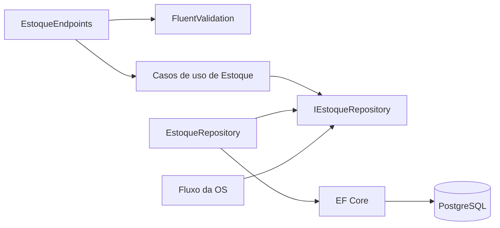

# Auditoria do Endpoint de Estoque

## Escopo

Foram revisados endpoints, contratos HTTP, comandos, validadores, serviços, entidade, acessores, repositório, configuração do Entity Framework, migrations, injeção de dependência, integração com a Ordem de Serviço e testes. A auditoria inicial de 25/08/2026 foi atualizada com as correções validadas em 26/08/2026.

## Conclusão executiva

A separação entre catálogo (`Produto`) e saldo (`Estoque`) está operacional. O modelo do EF Core materializa as entidades, a migration cria Estoque/Categorias preservando o saldo legado, as rotas usam `ProdutoId` de forma consistente e a entidade impede saldo negativo. O build encerra sem avisos e as suítes estão verdes.

## Fluxo implementado



## Achados corrigidos

- construtor e binding do EF Core alinhados com `ProdutoId`;
- migration e model snapshot criados para Estoque e as três categorias;
- saldo antigo de `Produto.Quantidade` migrado para a nova tabela;
- quantidade da entrada copiada e persistência aguardada;
- consulta corrigida para `GET /api/v1/estoque/{produtoId}`;
- baixa orientada por `ProdutoId`, com resposta `200 OK` e saldo não negativo;
- índice único para uma linha de estoque por produto;
- token `Versao` configurado para concorrência otimista e conflito convertido em HTTP 409;
- tipo de quantidade padronizado como `int` entre contrato, comando, entidade e resposta;
- injeção de `IEstoqueRepository` corrigida na atualização do inventário;
- categoria e quantidade integradas à criação do produto;
- serviços de Estoque registrados na injeção de dependência.

## Melhorias futuras

- substituir os demais usos de `GetAwaiter().GetResult()` da solução por `async/await`;
- modelar um histórico de movimentações para auditoria e idempotência;
- executar migration e testes de carga/concorrência em PostgreSQL real;
- tornar baixa de estoque e transição da OS uma única transação explícita;
- ampliar o DTO da listagem caso descrição e categoria sejam necessárias ao consumidor.

## Acessores e invariantes das entidades

O uso de `private set` reduz mutações externas, mas setters privados não bastam. Cada método deve representar uma intenção e proteger invariantes:

| Entidade | Situação atual | Recomendação |
| --- | --- | --- |
| `Estoque` | `Adicionar`, `Baixar` e `DefinirQuantidade` validam o saldo e renovam a versão | Manter testes de invariantes e concorrência |
| `Produto` | Construtor e método `Atualizar` encapsulam descrição, valor e categoria | Considerar factory para concentrar validações de criação |
| `OrdemServico` | Métodos de transição e alteração encapsulam parte do estado | Evitar métodos genéricos como `AtribuirValor`; manter operações orientadas ao domínio e validar vínculos |
| Itens da OS | Preço e quantidade históricos foram encapsulados | Padronizar tipo de quantidade e garantir IDs corretos da OS ao criar relacionamentos |

Um contrato de domínio sugerido para o saldo é:

```csharp
public void Adicionar(int quantidade)
{
    if (quantidade <= 0) throw new ArgumentOutOfRangeException(nameof(quantidade));
    Quantidade += quantidade;
}

public void Baixar(int quantidade)
{
    if (quantidade <= 0) throw new ArgumentOutOfRangeException(nameof(quantidade));
    if (quantidade > Quantidade) throw new InvalidOperationException("Estoque insuficiente.");
    Quantidade -= quantidade;
}
```

O projeto adotou `int` porque o domínio atual trata peças em unidades discretas.

## Contrato HTTP implementado

| Método | Rota | Comportamento |
| --- | --- | --- |
| `GET` | `/api/v1/estoque` | Lista saldos |
| `GET` | `/api/v1/estoque/{produtoId}` | Consulta saldo pelo produto |
| `POST` | `/api/v1/estoque` | Adiciona quantidade e retorna o saldo atualizado |
| `PUT` | `/api/v1/estoque` | Registra baixa, impede saldo negativo e retorna o saldo atualizado |

Para uma solução auditável, considere modelar `MovimentacaoEstoque` com ID, produto, quantidade, tipo, motivo, OS relacionada, usuário e data. Atualizar somente um número não mantém histórico de entradas/saídas.

## Validações mínimas

- `ProdutoId` obrigatório e produto existente;
- quantidade maior que zero;
- unidade/tipo numérico consistente;
- saldo suficiente na baixa;
- uma linha de estoque por produto;
- produto ativo e compatível com a operação;
- idempotência para callbacks/retries;
- transação entre baixa e mudança de estado da OS;
- controle de concorrência otimista (`rowversion`/token) ou atualização atômica no banco.

## Testes implementados e pendentes

### Implementados

- entidade aceita entrada positiva e rejeita zero/negativo;
- baixa correta, baixa total e rejeição por saldo insuficiente;
- serviço rejeita produto inexistente;
- serviço usa `GetByIdProdutoAsync`;
- criação aguarda a persistência;
- concorrência otimista por token de versão.

Também existem testes HTTP de criação, consulta, entrada cumulativa, baixa, 400 e 404, além de integração direta para conflito concorrente.

### Pendentes

- migration aplicada em PostgreSQL real;
- fluxo diagnóstico -> orçamento -> finalização realizando uma única baixa.

## Evidência da verificação

- `dotnet build TechChallenge.slnx --no-restore`: sucesso, 0 avisos e 0 erros;
- testes unitários: 111 aprovados, 0 falhos;
- testes de integração: 26 aprovados, 0 falhos;
- testes específicos de Estoque: entidade, serviços, endpoints e concorrência;
- migration `AddPhase2InventoryCategories` e model snapshot gerados.

O item **Estoque e Categorias** está concluído no checklist de aplicação. A validação operacional em PostgreSQL real permanece como melhoria antes de produção.
