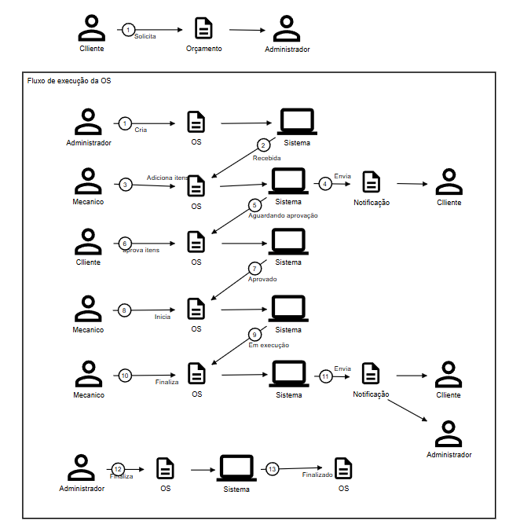

# Domain-Driven Design (DDD)

## Visão geral

O domínio deste projeto representa o funcionamento de uma oficina mecânica. O fluxo principal começa com a solicitação de um orçamento pelo cliente e acompanha todo o ciclo de vida de uma Ordem de Serviço (OS), desde a sua criação até a finalização.



## Linguagem do domínio

Os principais termos utilizados no projeto são:

- **Cliente:** proprietário ou responsável pelo veículo e pela aprovação do orçamento.
- **Veículo:** automóvel vinculado ao atendimento realizado pela oficina.
- **Orçamento:** estimativa dos serviços e produtos necessários para o atendimento.
- **Ordem de Serviço (OS):** registro central que acompanha o atendimento do veículo.
- **Administrador:** responsável pelos cadastros, abertura e encerramento administrativo da OS.
- **Vendedor:** também pode abrir uma OS, conforme definido nos requisitos funcionais.
- **Mecânico:** responsável pelo diagnóstico, inclusão dos serviços e produtos, execução e conclusão técnica do trabalho.
- **Serviço:** atividade executada pelo mecânico, como revisão, troca ou reparo.
- **Produto:** peça ou item de inventário utilizado na execução do serviço.
- **Diagnóstico:** identificação dos serviços e produtos necessários para resolver o problema relatado.

## Agregado Ordem de Serviço

A `OrdemServico` é o principal candidato a **raiz de agregado** do domínio. As operações do fluxo devem acontecer por meio dela, garantindo que as regras de negócio sejam respeitadas em cada mudança de estado.

Atualmente, a entidade relaciona:

- um cliente responsável;
- um veículo;
- um funcionário responsável;
- uma coleção de serviços;
- uma coleção de produtos;
- uma descrição ou relato inicial;
- o estado atual e as transições permitidas;
- valor, desconto e acréscimo;
- data de criação;
- data de atualização;
- data de finalização.

As entidades `Cliente`, `Veiculo`, `Funcionario`, `Servico` e `Produto` possuem identidade própria. Por isso, são referenciadas pela OS por meio de seus identificadores.

## Fluxo do orçamento

Antes da abertura da Ordem de Serviço, o diagrama apresenta a solicitação inicial:

1. O **cliente solicita um orçamento** para a oficina.
2. A solicitação é encaminhada ao **administrador**.
3. A partir das informações do cliente e do veículo, o administrador inicia o atendimento e cria a Ordem de Serviço.

No código atual, o orçamento é representado pela composição de serviços e produtos da própria OS. Os preços são copiados para os itens da OS e o valor total é calculado no envio para aprovação. Ainda não existe uma entidade `Orcamento` independente.

## Fluxo de execução da Ordem de Serviço

### 1. Criação da OS

O administrador ou vendedor cria uma OS informando o cliente responsável, o veículo, o funcionário responsável e o relato inicial. A OS é persistida diretamente no estado **Recebida**.

**Comando de domínio:** `CriarOrdemServico`  
**Estado resultante:** `Recebida`

### 2. Diagnóstico e inclusão de itens

O mecânico assume a OS e registra o diagnóstico, adicionando os serviços e produtos necessários. Pelos requisitos, o mecânico somente pode assumir uma OS que esteja com estado **Recebida** e não pode possuir outra OS em andamento.

Ao ser atribuída ao mecânico, a OS deve passar pelo estado **Em diagnóstico**.

**Comandos de domínio:**

- `AtribuirOrdemServico`;
- `RegistrarDiagnostico`;
- `AdicionarServico`;
- `AdicionarProduto`.

**Eventos esperados:**

- `OrdemServicoAtribuida`;
- `DiagnosticoRegistrado`;
- `ItemAdicionadoAoOrcamento`.

Os preços atuais de serviços e produtos são copiados para os itens associados à OS. A verificação de disponibilidade em estoque e as notificações ainda não foram implementadas.

### 3. Envio para aprovação

Depois do diagnóstico, o sistema soma serviços e produtos, considerando descontos e acréscimos dos itens e da OS. Havendo ao menos um item, a OS passa para **Aguardando aprovação**. O envio de notificação ao cliente ainda está no roadmap.

**Comando de domínio:** `EnviarOrcamentoParaAprovacao`  
**Eventos esperados:**

- `OrcamentoEnviado`;
- `OrdemServicoAguardandoAprovacao`;
- `ClienteNotificado`.

### 4. Decisão do orçamento

O orçamento pode ser aprovado ou reprovado. A aprovação move a OS diretamente de **Aguardando aprovação** para **Em execução**; não há um estado intermediário `Aprovada`. A reprovação move a OS para **Reprovada**, de onde ela pode retornar para **Em diagnóstico** para revisão.

**Comandos de aplicação:**

- `AprovarOrcamento`;
- `ReprovarOrcamento`;
- `RetornarParaDiagnostico`.

O fluxo de aprovação parcial e negociação ainda precisa ser definido.

### 5. Execução

Com a aprovação, a OS já entra em **Em execução**. O mecânico executa o trabalho e, ao concluí-lo, utiliza a operação de finalização.

### 6. Finalização técnica

Ao terminar os serviços, o mecânico finaliza a OS. A transição de **Em execução** para **Finalizada** também registra a data de finalização.

**Comando de aplicação:** `FinalizarOS`

### 7. Entrega e cancelamento

Depois da finalização técnica, o administrador ou vendedor registra a entrega do veículo, movendo a OS para **Entregue**. Um administrador também pode cancelar uma OS nos estados `Recebida`, `EmDiagnostico`, `AguardandoAprovacao`, `Reprovada` ou `EmExecucao`.

**Comandos de aplicação:** `EntregarOS` e `CancelarOS`

## Ciclo de estados

O fluxo descrito pelo diagrama pode ser representado pela seguinte sequência:

```text
Recebida
  ↓
Em diagnóstico
  ↓
Aguardando aprovação
  ↓
Em execução
  ↓
Finalizada
  ↓
Entregue
```

O caminho alternativo de revisão do orçamento é `Aguardando aprovação → Reprovada → Em diagnóstico`. O cancelamento é terminal e pode ocorrer antes da finalização. As transições são controladas pela própria Ordem de Serviço. Por exemplo:

- somente uma OS `Recebida` pode ser atribuída a um mecânico;
- somente uma OS `Em diagnóstico` pode receber o diagnóstico;
- somente uma OS `Em diagnóstico` e com ao menos um item pode aguardar aprovação;
- somente uma OS `Aguardando aprovação` pode entrar em execução ou ser reprovada;
- somente uma OS `Em execução` pode ser finalizada;
- somente uma OS `Finalizada` pode ser entregue.

## Contextos do domínio

Com base no desenho e nos requisitos atuais, o domínio pode ser dividido nos seguintes contextos:

- **Atendimento:** clientes, veículos, solicitação de orçamento e abertura da OS.
- **Execução da oficina:** atribuição do mecânico, diagnóstico, execução e conclusão técnica.
- **Catálogo e inventário:** serviços oferecidos, produtos e disponibilidade em estoque.
- **Aprovação:** apresentação do orçamento e decisão do cliente.
- **Notificações:** comunicação com cliente, mecânico e administrador.

Essa separação é uma proposta inicial. Os limites devem ser refinados conforme as regras do negócio forem implementadas.

## Relação entre o desenho e o código atual

| Parte do domínio | Situação atual |
| --- | --- |
| Entidades `Cliente`, `Veiculo`, `Funcionario`, `Servico`, `Produto` e `OrdemServico` | Modeladas no projeto de domínio |
| Relacionamentos da OS | Configurados com Entity Framework |
| Criação, consulta, listagem e exclusão da OS | Integradas aos casos de uso e à persistência |
| Atribuição da OS ao mecânico | Implementada, incluindo limite de uma OS ativa por mecânico |
| Registro do diagnóstico | Implementado com associação de serviços e produtos |
| Listagem de OS para a oficina | Implementada para OS em diagnóstico |
| Persistência da OS | Implementada com Entity Framework e PostgreSQL |
| Estados da OS | Máquina de estados implementada na entidade |
| Orçamento e decisão do cliente | Cálculo, envio, aprovação, reprovação e revisão implementados |
| Verificação de estoque | Prevista nos requisitos, ainda não implementada |
| Notificações | Representadas no diagrama, ainda não implementadas |
| Finalização, entrega e cancelamento da OS | Implementados |

Portanto, o diagrama documenta o **fluxo de negócio desejado**, enquanto o código atual já cobre o ciclo principal da OS. Permanecem pendentes os fluxos de estoque, notificações, pagamento, recibo, aprovação parcial e retrabalho.
