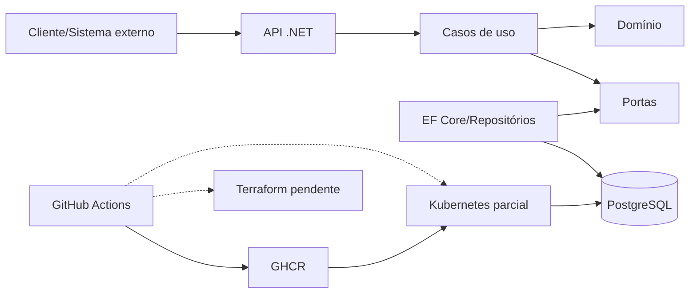

# Documento de Entrega - Fase 2

> Fonte para o PDF final do portal. Não exportar como entrega definitiva enquanto os campos pendentes e os bloqueadores do checklist não forem resolvidos.

## Grupo

| Participante | RM | GitHub |
| --- | --- | --- |
| Gabriel Teixeira | RM374752 | [@louistx](https://github.com/louistx) |
| Brunno de Oliveira | RM374818 | [@DevDoubleN](https://github.com/DevDoubleN) |
| Luís Henrique | RM374786 | [@Ace0777](https://github.com/Ace0777) |
| Caio Montilha | RM375494 | [@cmontilha](https://github.com/cmontilha) |
| Gustavo Keiji | RM374965 | [@GuKeiji](https://github.com/GuKeiji) |

## Links da entrega

| Item | Link ou estado |
| --- | --- |
| Repositório | [github.com/louistx/fiap-tech-challenge](https://github.com/louistx/fiap-tech-challenge) |
| Documentação | [Índice](README.md) |
| Arquitetura | [Arquitetura Proposta - Fase 2](arquitetura-fase-2.md) |
| APIs | Swagger/OpenAPI em runtime; URL pública ou collection versionada pendente |
| Vídeo de até 15 minutos | **PENDENTE - inserir URL pública ou não listada do YouTube/Vimeo** |
| Compartilhamento com `soat-architecture` | **PENDENTE - confirmar na configuração do GitHub** |

## Desenho resumido da arquitetura

A descrição completa de componentes, recursos e fluxo de deploy está em [Arquitetura Proposta - Fase 2](arquitetura-fase-2.md).

## Resumo da solução

A solução mantém o monólito modular da Fase 1 e separa API, aplicação, domínio, contratos e infraestrutura. PostgreSQL é usado para persistência; Docker e Docker Compose suportam o desenvolvimento local. A Fase 2 propõe execução em Kubernetes, escalabilidade via HPA, infraestrutura Terraform e entrega por GitHub Actions.

No estado validado em 26/08/2026, Estoque/Categorias e as principais correções das APIs da Fase 2 estão operacionais, com build sem avisos, 111 testes unitários e 26 integrações aprovados. A entrega ainda não está pronta porque Kubernetes está incompleto, Terraform não existe, callback/notificação externos não foram implementados e o deploy não foi integrado à pipeline.

## Checklist antes de exportar o PDF

- [ ] Todos os bloqueadores do [Checklist de Entregáveis](fase-2-entregaveis.md) foram resolvidos.
- [x] Build, testes unitários e testes de integração estão verdes na validação local.
- [ ] A URL/collection das APIs foi publicada e validada.
- [ ] Kubernetes e HPA foram demonstrados em ambiente funcional.
- [ ] Terraform provisionou cluster e banco conforme a documentação.
- [ ] CI/CD executou build, testes, imagem, infraestrutura e deploy.
- [ ] O vídeo foi publicado e o link substituiu o placeholder.
- [ ] O repositório foi compartilhado com `soat-architecture`.
- [ ] O desenho final corresponde exatamente aos recursos utilizados.
- [ ] O PDF foi revisado visualmente e todos os links foram testados.

Consulte o [Roteiro do Vídeo](roteiro-video-fase-2.md) antes da gravação.
