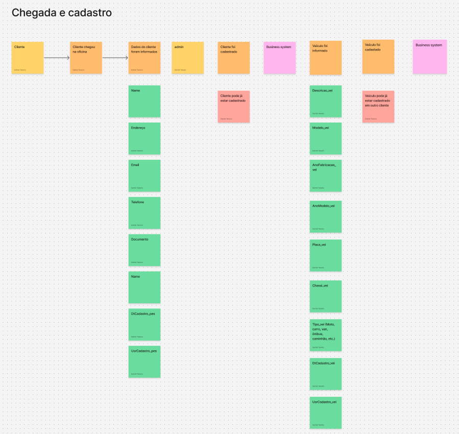
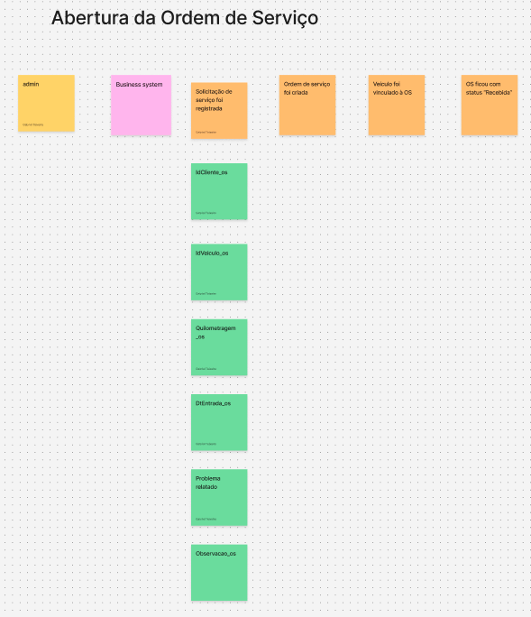
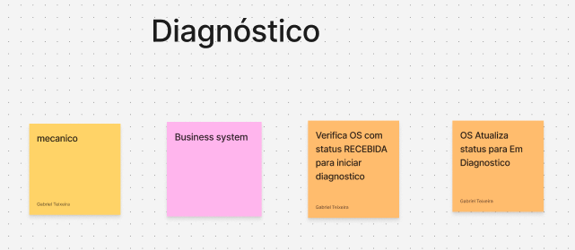
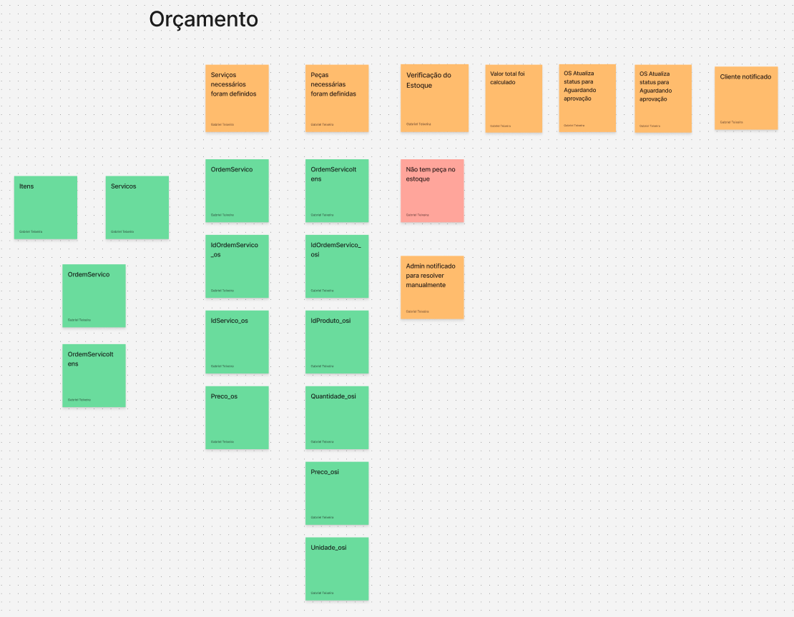
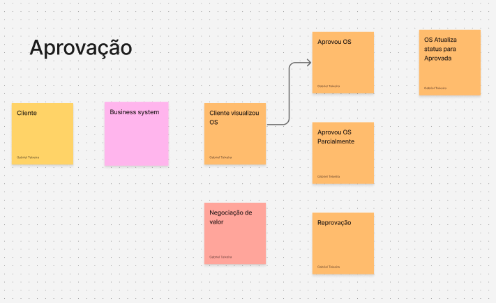
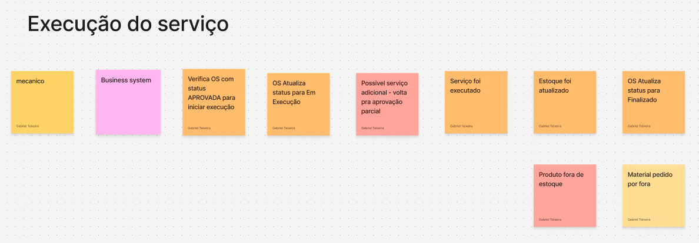
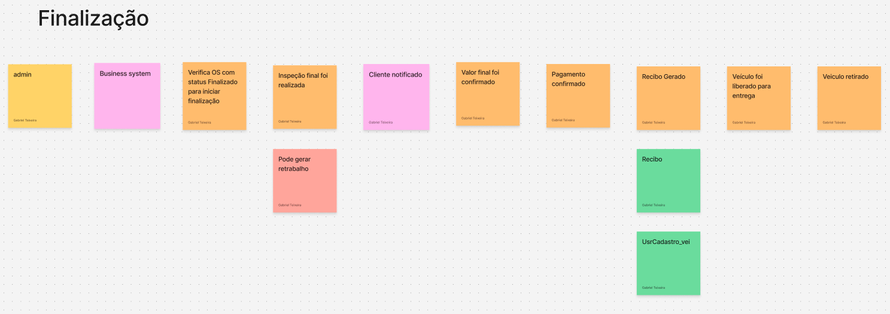

# Event Storming

## Visão geral

O Event Storming foi utilizado para mapear o funcionamento da oficina a partir dos acontecimentos relevantes para o negócio. O fluxo cobre desde a chegada do cliente e o cadastro do veículo até o pagamento e a retirada do veículo.

O quadro colaborativo completo pode ser consultado no Figma:

- [Visualizar Event Storming no Figma](https://www.figma.com/board/RDxPpsRgOD8J3wvPTh2659/Untitled?node-id=0-1&p=f)

## Elementos identificados

Com base nas cores e na organização do quadro, foram identificados os seguintes elementos:

- **Atores:** cliente, administrador e mecânico.
- **Sistema:** automações e validações executadas pelo sistema da oficina.
- **Eventos de domínio:** fatos que aconteceram no negócio, como cliente cadastrado, OS criada, orçamento aprovado e veículo retirado.
- **Dados e entidades:** informações necessárias para executar uma ação, como cliente, veículo, serviços, produtos e recibo.
- **Problemas e decisões pendentes:** exceções ou pontos que ainda precisam de refinamento, como falta de estoque, negociação, retrabalho e serviço adicional.

Os nomes técnicos apresentados nesta documentação foram normalizados para facilitar a implementação. O quadro original foi mantido nas imagens.

## 1. Chegada e cadastro



O fluxo começa quando o cliente chega à oficina e fornece seus dados. O administrador consulta o sistema para verificar se o cliente já possui cadastro.

### Fluxo principal

1. O cliente chega à oficina.
2. Os dados do cliente são informados.
3. O administrador consulta o cadastro.
4. Caso o cliente ainda não exista, seus dados são registrados.
5. O sistema registra o evento **Cliente cadastrado**.
6. Os dados do veículo são informados.
7. O administrador verifica se o veículo já está cadastrado.
8. Caso seja um veículo novo, o cadastro é realizado.
9. O sistema registra o evento **Veículo cadastrado**.

### Dados levantados

Para o cliente, o quadro apresenta dados como nome, endereço, e-mail, telefone e documento. Para o veículo, apresenta descrição, modelo, ano de fabricação, ano do modelo, placa, chassi e tipo.

### Regras e exceções

- Um cliente pode já estar cadastrado.
- Um veículo pode estar cadastrado para outro cliente.
- Antes de criar um novo registro, o sistema deve pesquisar por identificadores únicos, como CPF para o cliente e placa ou chassi para o veículo.
- A associação entre cliente e veículo deve ser validada antes da abertura da OS.

**Comandos sugeridos:**

- `CadastrarCliente`;
- `CadastrarVeiculo`;
- `VincularVeiculoAoCliente`.

**Eventos de domínio:**

- `ClienteCadastrado`;
- `VeiculoCadastrado`;
- `VeiculoVinculadoAoCliente`.

## 2. Abertura da Ordem de Serviço



Depois que cliente e veículo são identificados, o administrador registra a solicitação de atendimento.

### Fluxo principal

1. O administrador solicita a abertura da OS.
2. São informados o cliente, o veículo, a quilometragem, a data de entrada, o problema relatado e observações.
3. O sistema cria a Ordem de Serviço.
4. O veículo é vinculado à OS.
5. A OS é encaminhada para a fila da oficina com o estado **Recebida**.

O quadro apresenta diretamente o estado `Recebida`. Essa foi a interpretação adotada no código: a OS é persistida diretamente como `Recebida`, sem manter um estado intermediário `Criada`.

**Comando sugerido:** `CriarOrdemServico`

**Eventos de domínio:**

- `OrdemServicoCriada`;
- `VeiculoVinculadoAOrdemServico`;
- `OrdemServicoRecebida`.

## 3. Início do diagnóstico



O mecânico inicia o atendimento de uma OS disponível na fila.

### Fluxo principal

1. O mecânico seleciona uma OS.
2. O sistema verifica se a OS está com o estado **Recebida**.
3. O sistema verifica se o mecânico pode assumir um novo atendimento.
4. A OS é atribuída ao mecânico.
5. O estado da OS é alterado para **Em diagnóstico**.

Conforme os requisitos funcionais, um mecânico somente pode ter uma OS atribuída por vez.

**Comando sugerido:** `AtribuirOrdemServico`

**Eventos de domínio:**

- `OrdemServicoAtribuidaAoMecanico`;
- `DiagnosticoIniciado`;
- `OrdemServicoEmDiagnostico`.

## 4. Diagnóstico e orçamento



Durante o diagnóstico, o mecânico identifica os serviços e produtos necessários. Esses itens formam o orçamento vinculado à Ordem de Serviço.

### Fluxo principal

1. Os serviços necessários são definidos.
2. As peças ou produtos necessários são definidos.
3. O sistema verifica a disponibilidade dos produtos no estoque.
4. O valor total dos serviços e produtos é calculado.
5. A OS passa para o estado **Aguardando aprovação**.
6. O cliente é notificado para analisar o orçamento.

### Composição do orçamento

O quadro sugere duas associações:

- **Serviço da OS:** identifica a OS, o serviço e o preço considerado no orçamento.
- **Produto da OS:** identifica a OS, o produto, a quantidade, a unidade e o preço considerado.

Registrar o preço no item da OS é importante porque o valor do catálogo pode mudar depois que o orçamento for criado.

### Falta de estoque

Caso não exista quantidade suficiente de um produto:

1. O sistema identifica a indisponibilidade.
2. O orçamento não deve seguir automaticamente para aprovação.
3. O administrador é notificado para resolver a situação manualmente.
4. Após reposição, substituição ou remoção do produto, o orçamento pode ser recalculado.

**Comandos sugeridos:**

- `RegistrarDiagnostico`;
- `AdicionarServicoAoOrcamento`;
- `AdicionarProdutoAoOrcamento`;
- `VerificarDisponibilidadeEmEstoque`;
- `CalcularValorDoOrcamento`;
- `EnviarOrcamentoParaAprovacao`.

**Eventos de domínio:**

- `ServicosDefinidos`;
- `ProdutosDefinidos`;
- `EstoqueVerificado`;
- `ProdutoIndisponivel`;
- `ValorDoOrcamentoCalculado`;
- `OrdemServicoAguardandoAprovacao`;
- `ClienteNotificado`.

## 5. Aprovação do orçamento



O cliente visualiza o orçamento e decide se autoriza a execução.

### Possíveis decisões

- **Aprovação integral:** todos os serviços e produtos são autorizados, e a OS passa para **Aprovada**.
- **Aprovação parcial:** somente parte dos itens é autorizada. O orçamento deve ser ajustado e recalculado antes da execução.
- **Reprovação:** o cliente não autoriza a execução.
- **Negociação de valor:** o cliente solicita uma revisão dos valores antes de tomar a decisão.

No código, a aprovação integral leva a OS diretamente para `EmExecucao`. A reprovação leva para `Reprovada`, permitindo o retorno a `EmDiagnostico` para revisão. Aprovação parcial e negociação ainda precisam ser definidas.

**Comandos sugeridos:**

- `AprovarOrcamento`;
- `AprovarOrcamentoParcialmente`;
- `ReprovarOrcamento`;
- `SolicitarNegociacao`.

**Eventos de domínio:**

- `OrcamentoVisualizado`;
- `OrcamentoAprovado`;
- `OrcamentoParcialmenteAprovado`;
- `OrcamentoReprovado`;
- `NegociacaoSolicitada`;
- `OrdemServicoAprovada`.

## 6. Execução do serviço



Após a aprovação, o mecânico pode iniciar o trabalho.

### Fluxo principal

1. O mecânico solicita o início da execução.
2. O sistema confirma que a OS está **Aprovada**.
3. O estado é alterado para **Em execução**.
4. Os serviços autorizados são executados.
5. Os produtos utilizados são baixados do estoque.
6. O mecânico registra a conclusão técnica.

### Exceções durante a execução

- **Serviço adicional:** se surgir uma necessidade não prevista, a execução desse item não deve ocorrer automaticamente. Um orçamento complementar deve voltar para aprovação do cliente.
- **Produto fora de estoque:** o sistema deve impedir o consumo e iniciar o processo de reposição ou substituição.
- **Material pedido por fora:** a compra externa precisa ser registrada antes do uso e da atualização do estoque.

O quadro chama a conclusão do mecânico de `Finalizado`. Para não confundir essa etapa com o encerramento administrativo posterior, esta documentação utiliza o estado **Execução concluída**.

**Comandos sugeridos:**

- `IniciarExecucao`;
- `RegistrarServicoExecutado`;
- `RegistrarConsumoDeProduto`;
- `SolicitarAprovacaoDeServicoAdicional`;
- `ConcluirExecucao`.

**Eventos de domínio:**

- `ExecucaoIniciada`;
- `ServicoExecutado`;
- `ProdutoConsumido`;
- `EstoqueAtualizado`;
- `ServicoAdicionalIdentificado`;
- `ExecucaoConcluida`.

## 7. Finalização, pagamento e entrega



Após a conclusão técnica, o administrador realiza as validações finais e entrega o veículo.

### Fluxo principal

1. O sistema confirma que a execução da OS foi concluída.
2. O administrador realiza a inspeção final.
3. O cliente é notificado de que o veículo está pronto.
4. O valor final é confirmado.
5. O pagamento é registrado.
6. Um recibo é gerado.
7. O veículo é liberado para entrega.
8. O cliente retira o veículo.
9. A OS é encerrada administrativamente.

### Exceção de retrabalho

Se a inspeção final identificar um problema, a OS deve entrar em **Retrabalho** e retornar à execução sem gerar uma nova cobrança pelos itens já aprovados, salvo quando houver uma nova necessidade autorizada pelo cliente.

**Comandos sugeridos:**

- `RealizarInspecaoFinal`;
- `SolicitarRetrabalho`;
- `ConfirmarValorFinal`;
- `RegistrarPagamento`;
- `GerarRecibo`;
- `LiberarVeiculo`;
- `RegistrarRetiradaDoVeiculo`;
- `FinalizarOrdemServico`.

**Eventos de domínio:**

- `InspecaoFinalRealizada`;
- `RetrabalhoSolicitado`;
- `ClienteNotificado`;
- `ValorFinalConfirmado`;
- `PagamentoConfirmado`;
- `ReciboGerado`;
- `VeiculoLiberado`;
- `VeiculoRetirado`;
- `OrdemServicoFinalizada`.

## Linha do tempo consolidada

```text
Cliente e veículo identificados
  ↓
Ordem de Serviço criada
  ↓
Recebida
  ↓
Em diagnóstico
  ↓
Orçamento calculado
  ↓
Aguardando aprovação
  ↓
Aprovada
  ↓
Em execução
  ↓
Execução concluída
  ↓
Inspeção final
  ↓
Pagamento confirmado
  ↓
Veículo liberado e retirado
  ↓
Finalizada
```

Fluxos alternativos podem levar a negociação, reprovação, aprovação parcial, reposição de estoque, orçamento complementar ou retrabalho.

## Políticas de negócio identificadas

- Não cadastrar novamente um cliente que já existe.
- Validar a propriedade ou responsabilidade sobre o veículo.
- Não abrir uma OS sem cliente e veículo identificados.
- Somente uma OS `Recebida` pode iniciar diagnóstico.
- Um mecânico não pode manter mais de uma OS ativa ao mesmo tempo.
- Não enviar orçamento para aprovação sem verificar o estoque.
- Não iniciar execução sem aprovação do cliente.
- Não executar serviço adicional sem nova aprovação.
- Atualizar o estoque quando produtos forem consumidos.
- Não liberar o veículo sem inspeção e confirmação do pagamento.
- Registrar recibo, retirada e encerramento da OS.

## Agregados e contextos sugeridos

O Event Storming indica a `OrdemServico` como agregado central. Ela coordena o atendimento, o diagnóstico, o orçamento, a aprovação e a execução, mas não deve concentrar todas as responsabilidades do sistema.

Outros agregados ou contextos relevantes são:

- **Cadastro:** cliente e veículo.
- **Ordem de Serviço:** ciclo de vida, mecânico responsável e transições de estado.
- **Orçamento:** serviços, produtos, quantidades, preços e decisão do cliente.
- **Inventário:** disponibilidade, reserva, entrada e baixa de produtos.
- **Pagamento:** valor final, confirmação e recibo.
- **Notificação:** comunicações enviadas aos envolvidos.

## Pontos que ainda precisam de decisão

- Qual documento identifica unicamente o cliente.
- Como tratar um veículo associado anteriormente a outro cliente.
- O que acontece depois de uma aprovação parcial.
- Quem pode conceder descontos durante uma negociação.
- Como reservar o estoque enquanto o cliente avalia o orçamento.
- Como registrar compras externas e materiais pedidos por fora.
- Qual estado representa a conclusão do mecânico antes da finalização administrativa.
- Em qual momento exato a OS deve ser marcada como `Finalizada`.
- Como calcular garantia e custo em casos de retrabalho.

## Relação com o código atual

O quadro representa o processo de negócio desejado. No código atual, os cadastros e o ciclo principal da OS já estão integrados à persistência, enquanto os fluxos complementares permanecem no roadmap.

| Parte do Event Storming | Situação atual |
| --- | --- |
| Cliente, veículo, funcionário, serviço, produto e OS | Entidades existentes |
| Cadastro e consulta | CRUD integrado aos casos de uso e repositórios |
| Criação e consulta da OS | Implementadas com persistência PostgreSQL |
| Atribuição ao mecânico | Implementada com limite de uma OS ativa por mecânico |
| Registro do diagnóstico | Implementado com serviços e produtos associados |
| Estados e transições da OS | Máquina de estados implementada no domínio |
| Orçamento e preços históricos dos itens | Cálculo e cópia dos preços implementados; quantidade ainda não modelada |
| Aprovação integral e reprovação | Implementadas; a OS reprovada pode retornar ao diagnóstico |
| Aprovação parcial e negociação | Ainda não implementadas |
| Reserva e baixa de estoque | Ainda não implementadas |
| Notificações | Ainda não implementadas |
| Execução, finalização e entrega | Implementadas no ciclo de estados |
| Inspeção e retrabalho | Ainda não implementados |
| Pagamento e recibo | Ainda não modelados |

As imagens documentam a descoberta do domínio. Os pontos ainda pendentes devem ser refinados e transformados em regras explícitas, estados válidos e casos de uso testáveis.
