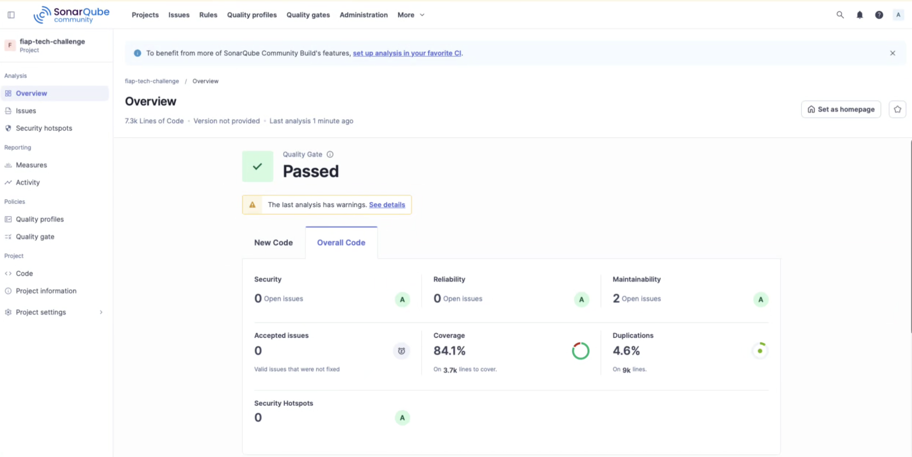

# Relatório de Análise de Vulnerabilidades

## Visão geral

A análise estática do projeto foi executada localmente com o **SonarQube Community Build** e o **SonarScanner for .NET**. O processo considera o código da aplicação, métricas de segurança, confiabilidade, manutenibilidade, duplicação e a cobertura produzida pelos testes automatizados.

> **Escopo temporal:** os resultados abaixo são evidência histórica da execução anterior à refatoração de Estoque/Categorias incorporada na Fase 2. Em 25/08/2026, o build compilou com 10 avisos, 8 de 102 testes unitários falharam e os 20 testes de integração falharam. Portanto, o Quality Gate e a cobertura de 84,1% não representam o estado atual até que um novo scan seja executado com a suíte recuperada.

## Resultado da análise

O painel registrou aprovação no Quality Gate e apresentou os seguintes resultados para o código geral:

| Métrica | Resultado |
| --- | --- |
| Quality Gate | Aprovado (`Passed`) |
| Linhas de código analisadas | 7,3 mil |
| Problemas de segurança abertos | 0 — classificação A |
| Security Hotspots | 0 — classificação A |
| Problemas de confiabilidade | 0 — classificação A |
| Problemas de manutenibilidade | 2 — classificação A |
| Problemas aceitos | 0 |
| Cobertura de testes | 84,1% sobre 3,7 mil linhas a cobrir |
| Duplicação | 4,6% sobre 9 mil linhas |



O resultado atende à meta mínima de 80% de cobertura definida para os domínios críticos. Os dois apontamentos de manutenibilidade não impediram a aprovação do Quality Gate e devem ser avaliados na tela **Issues** antes da entrega definitiva.

> A ausência de problemas de segurança e hotspots no SonarQube representa o resultado da análise estática registrada nessa execução. Ela não garante, isoladamente, que a aplicação esteja livre de vulnerabilidades em dependências, containers, configuração ou ambiente de execução.

## Pré-requisitos

- Docker e Docker Compose;
- .NET SDK 10;
- ferramenta local `dotnet-sonarscanner`, declarada em `.config/dotnet-tools.json`;
- token de acesso criado no SonarQube local.

## Como executar a análise

### 1. Iniciar o SonarQube

Na raiz do repositório, execute:

```bash
docker compose \
  -f docker-compose/docker-compose.yml \
  -f docker-compose/docker-compose.override.yml \
  up -d sonarqube
```

O painel ficará disponível em:

```text
http://localhost:9000
```

No primeiro acesso, utilize `admin`/`admin` e altere a senha quando solicitado.

### 2. Criar o token

No SonarQube, acesse:

```text
My Account > Security > Generate Tokens
```

Armazene o token somente na sessão do terminal. Não o adicione ao repositório:

```bash
export SONAR_TOKEN="seu-token"
```

### 3. Restaurar o scanner

```bash
dotnet tool restore
```

### 4. Iniciar a coleta

```bash
dotnet tool run dotnet-sonarscanner -- begin \
  /k:"fiap-tech-challenge" \
  /d:sonar.host.url="http://localhost:9000" \
  /d:sonar.token="$SONAR_TOKEN" \
  /d:sonar.cs.opencover.reportsPaths=".sonar/coverage/**/coverage.opencover.xml" \
  /d:sonar.coverage.exclusions="**/Migrations/**,**/Program.cs,**/obj/**,**/Seeding/**,**/Context/ApplicationDbContextFactory.cs" \
  /d:sonar.cpd.exclusions="**/Migrations/**,tests/**/*.cs"
```

As exclusões removem código gerado, migrations, bootstrap e dados de seeding das métricas de cobertura. Os testes e migrations também são desconsiderados na análise de duplicação.

### 5. Compilar a solução

```bash
dotnet build TechChallenge.slnx --no-incremental
```

### 6. Executar os testes com cobertura

Testes unitários:

```bash
dotnet test tests/TechChallenge.Tests/TechChallenge.Tests.csproj \
  --no-build \
  /p:CollectCoverage=true \
  /p:CoverletOutputFormat=opencover \
  /p:CoverletOutput=../../.sonar/coverage/unit/
```

Testes de integração:

```bash
dotnet test tests/TechChallenge.IntegrationTests/TechChallenge.IntegrationTests.csproj \
  --no-build \
  /p:CollectCoverage=true \
  /p:CoverletOutputFormat=opencover \
  /p:CoverletOutput=../../.sonar/coverage/integration/
```

### 7. Publicar o resultado

```bash
dotnet tool run dotnet-sonarscanner -- end \
  /d:sonar.token="$SONAR_TOKEN"
```

Após o processamento, consulte:

```text
http://localhost:9000/dashboard?id=fiap-tech-challenge
```

## Verificações complementares

Para verificar pacotes NuGet com vulnerabilidades conhecidas:

```bash
dotnet list TechChallenge.slnx package \
  --vulnerable \
  --include-transitive
```

Para analisar a imagem da API com Trivy, primeiro construa os containers e depois execute:

```bash
docker compose \
  -f docker-compose/docker-compose.yml \
  -f docker-compose/docker-compose.override.yml \
  build techchallenge.api

trivy image techchallengeapi
```

Essas verificações complementam o SonarQube ao analisar dependências e a imagem do container, superfícies que não são integralmente cobertas pela análise estática do código.

## Revalidação exigida para a Fase 2

Antes da entrega, deve ser registrada uma nova execução após:

1. corrigir a construção/migration de `Estoque` e recuperar os testes;
2. incluir os novos endpoints de Estoque e Categorias na cobertura;
3. analisar as rotas duplicadas, nulabilidade e atualizações concorrentes de saldo;
4. executar análise de dependências e da imagem produzida pelo Dockerfile revisado;
5. anexar a nova evidência, data, commit e decisão dos apontamentos.

## Conclusão

A execução histórica foi aprovada no Quality Gate, não identificou problemas de segurança nem Security Hotspots e atingiu 84,1% de cobertura. Ela comprova o estado anterior, não a refatoração atual. A Fase 2 permanece sem evidência de segurança/qualidade válida até a nova análise sobre um commit com build sem alertas críticos e testes verdes.
